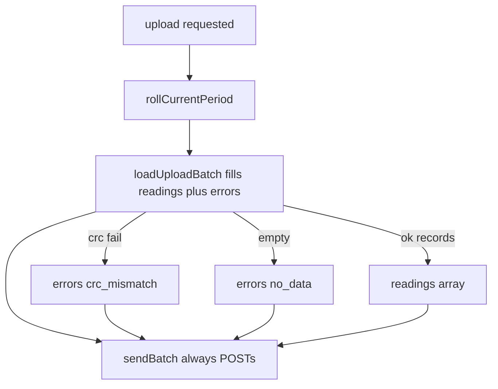

# Always upload + errors in JSON

## Goal

Every upload request (button or serial `u`) performs an HTTPS POST. Empty reading lists are allowed. Device-side problems discovered while building the batch (especially CRC failures) are included in the JSON as `errors[]`.

## JSON contract

Extend request body in [`docs/api/upload.md`](docs/api/upload.md), [`backend/app/schemas/upload.py`](backend/app/schemas/upload.py), and firmware `buildBody`:

```json
{
  "device_id": "meter-buddy-001",
  "meter_impulses_per_kwh": 1000,
  "upload_trigger": "button",
  "battery_v": 3.87,
  "battery_pct_est": 62,
  "readings": [],
  "errors": [
    { "code": "no_data", "message": "no unsynced readings" },
    { "code": "crc_mismatch", "message": "record CRC failed", "detail": "offset=64" }
  ]
}
```

- `errors`: optional array (default `[]`), max reasonable size on device (~8).
- Each error: `code` (string), `message` (string), optional `detail` (string).
- `battery_v` / `battery_pct_est` at **top level** (docs already describe them; Pydantic schema currently omits them — add as optional so empty-reading heartbeats still carry battery).
- `readings` may be empty; unknown keys still forbidden.

Backend keeps storing `raw_json`; no new SQLite columns required for v1 (errors visible in dump JSON / preview).

Stable `code` values firmware will emit:

- `no_data` — zero unsynced readings after roll
- `crc_mismatch` — bad CRC while scanning `/records.bin` (include byte offset in `detail`)
- `storage_unavailable` — LittleFS/storage not ready
- `batch_truncated` — more unsynced records exist than `MaxUploadRecords` (partial upload)

## Firmware wiring



### Storage — [`include/storage.h`](include/storage.h) / [`src/storage.cpp`](src/storage.cpp)

Extend `UploadBatch`:

```cpp
struct UploadError {
  const char *code;      // flash string literals OK
  char detail[40];       // optional; empty if unused
};

struct UploadBatch {
  ReadingRecord records[MaxUploadRecords];
  uint8_t count;
  uint32_t newestSequence;
  UploadError errors[8];
  uint8_t errorCount;
  bool truncated;        // more unsynced after batch full
};
```

`loadUploadBatch`:

- On storage not initialized → push `storage_unavailable`, return true (still allow POST).
- On CRC mismatch → push `crc_mismatch` with `detail` like `offset=%u`, **stop scanning** (following records untrusted), keep any good records already collected.
- When leaving because `MaxUploadRecords` with more unsynced ahead → set `truncated` / push `batch_truncated`.
- Do **not** treat empty count as failure.

### Upload — [`src/upload.cpp`](src/upload.cpp) / [`include/upload.h`](include/upload.h)

- Change `sendBatch` to accept batch **plus** live battery sample (or sample inside) so top-level `battery_*` is always set.
- `buildBody`: emit top-level battery, `readings` (possibly empty), and `errors` array (`message` can be a short fixed string per code).
- **Remove** early return `NoData` when `batch.count == 0` — still connect WiFi and POST.
- Keep `Result::NoData` unused or remove from enum/call sites; empty successful POST is `Success`.

### Main — [`src/main.cpp`](src/main.cpp) `handleUploadWake`

- If `batch.count == 0`, still call `sendBatch` once (do not `break` with “nothing to upload” before POST).
- Before send, if count==0 and no errors yet, ensure `no_data` is present (either in `loadUploadBatch` or here).
- LED: treat HTTP success as success even when `readings` empty (no `rapidErrorBlink` solely for empty data); keep error blink for WiFi/HTTP failure.
- OTA check: only when at least one reading was accepted this session (unchanged intent).

## Backend

- [`backend/app/schemas/upload.py`](backend/app/schemas/upload.py): add `UploadError` model; `errors: list[UploadError] = []`; optional `battery_v` / `battery_pct_est` on `UploadPayload`.
- Tests in [`backend/tests/`](backend/tests/): accept empty readings + errors; reject unknown error fields if `extra=forbid` on nested model.
- Update [`docs/api/upload.md`](docs/api/upload.md) to match.

## Out of scope

- Persisting errors into a dedicated SQL table
- Changing sync cursor rules (still only advance on 200/201 after a batch that included readings)