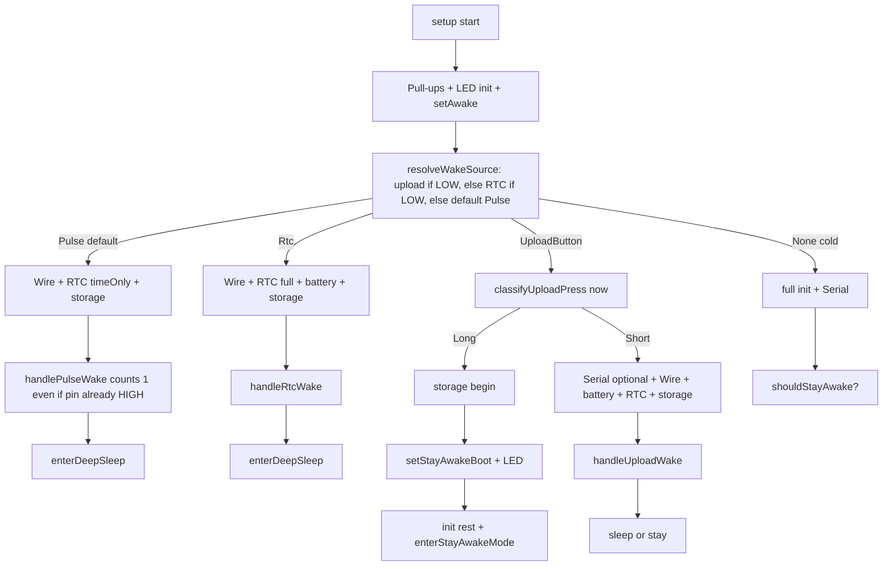

# Early wake resolution

## Problem

Today [`setup()`](src/main.cpp) does Serial (+300 ms), LED, Wire, battery, RTC, and LittleFS **before** resolving the wake source or classifying the upload press. Short taps release during that window; long-press timing is skewed; the user waits before any clear “working on it” feedback beyond a late `setAwake()`.

## S0 pulse constraint (must keep)

Meter **S0 pulses are ~3–50 ms**. ESP32-C3 deep-sleep GPIO wake + boot is typically **longer than that**, so by the time firmware runs the pulse pin is usually already HIGH again. Early resolve does **not** mean “read PulseWakePin and trust it.”

Keep (and document) the existing [`resolveWakeSource`](src/main.cpp) policy:

1. If not `ESP_SLEEP_WAKEUP_GPIO` → `None` (cold boot).
2. If upload button still LOW → `UploadButton` (human press lasts long enough to sample).
3. Else if RTC wake pin still LOW → `Rtc`.
4. Else → **`Pulse` by default** — do not require the S0 line to still be active.

`handlePulseWake` already counts the waking pulse as `pulses = 1` without needing the pin LOW. Early init only speeds getting to that handler; it must not change identification to “pulse pin must still be low.”

Upload short-press is a different problem (button often released during *late* boot); classifying upload **immediately after pins** fixes that. S0 never gets an equivalent “still held” check.

## Target boot shape



## Concrete changes in [`src/main.cpp`](src/main.cpp)

### 1. Split init helpers

- `initWakePinsAndLed()` — upload/pulse/RTC pull-ups, `configurePins()` / LED PWM, `setAwake()` (immediate user feedback).
- `initSerialIfNeeded()` — `Serial.begin`; **only** apply the 300 ms log delay on cold/stay-awake paths (or after upload classification), not before GPIO wake handling.
- `initSubsystems(bool needFullRtc)` — `Wire.begin`, `battery::begin`, `rtc_clock::beginTimeOnly()` or `begin()`, `storage::begin()`, set `rtcClockAvailable` / `storageAvailable`.

### 2. Resolve wake first (with S0-safe defaults)

Right after `initWakePinsAndLed()`:

```cpp
const auto cause = esp_sleep_get_wakeup_cause();
const WakeSource wakeSource = resolveWakeSource(cause);
```

No Serial/LittleFS/I2C before this. Preserve default-to-Pulse; refresh the comment to cite S0 3–50 ms vs wake latency.

### 3. Upload-button path: classify before heavy init

Extract press classification from `handleUploadButton` into something like:

```cpp
enum class UploadPressKind { Short, Long };
UploadPressKind classifyUploadPressFromWake();
```

Behavior:

- If button already HIGH → **Short** immediately (no debounce reject).
- If LOW → poll until stable release or `UploadLongPressMs` from **now** (`pressedAt = millis()`), with **no** wake credit — boot latency before classify is ~ms.
- On Long: call `storage::begin()` (only need stay-awake file), `handleStayAwakeToggle()`, wait for release, then `initSerialIfNeeded` + remaining subsystems + `enterStayAwakeMode()`.
- On Short: `initSerialIfNeeded` + full `initSubsystems`, then existing `handleUploadWake(true)`, then sleep/stay as today.

`handleUploadButton` for diagnostics / awake polling stays as the “already awake” classifier (no wake credit); shared polling logic with the wake classifier.

### 4. Lean pulse / RTC paths

- **Pulse:** `initSubsystems(timeOnly)` → `handlePulseWake` (always credit the wake pulse) → sleep. Skip Serial delay when possible; log only if already begun. Do not gate this path on `digitalRead(PulseWakePin)`.
- **RTC:** `initSubsystems(fullRtc)` → `handleRtcWake` → sleep.
- **Cold:** full init including Serial delay, then `shouldStayAwake()` / diagnostics as today.

### 5. Config cleanup

In [`include/config.example.h`](include/config.example.h) and [`include/local_config.h`](include/local_config.h):

- Remove `UploadWakeHoldCreditMs` (or set unused and delete call sites) — early classify makes the 2 s credit unnecessary and it wrongly turns ~2 s holds into long-presses.

## What stays the same

- Upload body (`handleUploadWake`, WiFi, batches, pulse ISR during upload).
- Deep-sleep arming and `shouldStayAwake()` (USB plugged+connected OR flash StayAwakeBoot).
- Long-press still always keeps the session awake after toggle.
- S0 identification via GPIO-wake default-to-Pulse (not live pin sample).

## Success criteria

- Short tap from sleep: upload starts soon after release/boot, LED goes full during upload (not stuck at 50% then sleep with no POST).
- Long press: threshold measured from early classify, toggle feedback near true ~4 s hold.
- Pulse wake stays the leanest path (no Serial wait) and still counts S0 wakes when the pulse line has already returned HIGH.