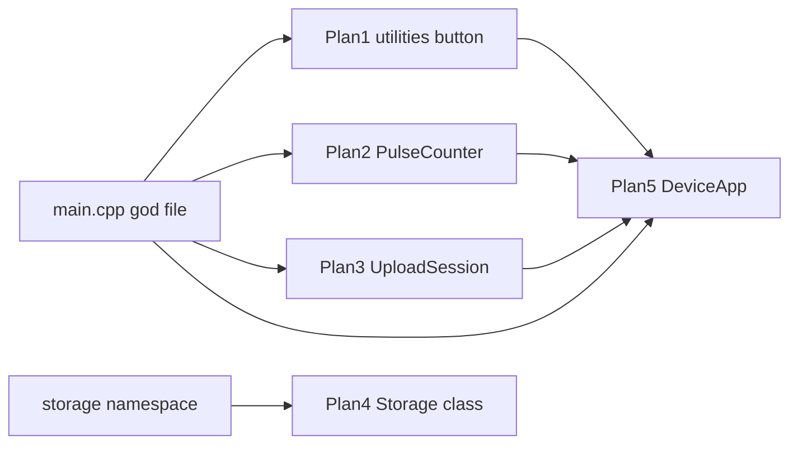

# Five compact OOP firmware refactor plans (5 feature branches)

## Delivery (requested)

On execute, create **five feature branches from current `main` HEAD**, each with **one standalone plan markdown** committed under [`.cursor/plans/`](.cursor/plans/). No firmware code changes in this step — plans only.

| Branch | Plan file | Scope |
| --- | --- | --- |
| `refactor/helpers-debounced-button` | `.cursor/plans/refactor_helpers_debounced_button.plan.md` | Plan 1 |
| `refactor/pulse-counter-led` | `.cursor/plans/refactor_pulse_counter_led.plan.md` | Plan 2 |
| `refactor/upload-session` | `.cursor/plans/refactor_upload_session.plan.md` | Plan 3 |
| `refactor/storage-class` | `.cursor/plans/refactor_storage_class.plan.md` | Plan 4 |
| `refactor/device-app` | `.cursor/plans/refactor_device_app.plan.md` | Plan 5 |

**Parallel subagents:** launch five `best-of-n-runner` (or shell) agents at once. Each agent:

1. Creates/checks out its branch from the same base commit (`main`).
2. Writes only its plan file (full self-contained plan — goal, files, API sketch, verify, constraints).
3. Commits with message like `docs: add Plan N OOP refactor plan`.
4. Does **not** push unless asked later; does **not** implement code.

Return to parent: branch name, commit SHA, plan path.

**Note:** Branches will diverge only by which plan file they add; they share the same base so any can be implemented or rebased independently.

---

Target: firmware only (`src/`, `include/`). Style model: [`include/awake_led.h`](include/awake_led.h) (small class, encapsulated state, clear methods). Domain behavior and wire contracts stay unchanged — pure structure refactors; skip SoT doc updates unless a later pass accidentally changes behavior.

Each plan is **independently implementable**. Prefer Plan 1 → 3 → 2 → 4 → 5 if sequencing for least conflict.



---

## Plan 1 — Shared helpers + `DebouncedButton` (biggest compact win)

**Goal:** Delete duplicated bounce/classify/time/TLS/log blocks; introduce one small button class.

**Extract:**
- [`include/log.h`](include/log.h) — unify `logEvent` / `logLine` from `main.cpp` and `upload.cpp` (serial-ready + `config::EnableSerialLogs`).
- [`include/time_format.h`](include/time_format.h) — shared `iso8601` / human UTC; replace `formatUtcTimestamp`, `formatHumanUtcTimestamp`, private `iso8601` in `upload.cpp`, and inline `strftime` in diagnostics `status`.
- TLS factory in `upload.cpp` (private or `include/http_client.h`) — one `configureTlsClient(WiFiClientSecure&, url)` used by `sendBatch` and `checkFirmwareUpdate`.
- `class DebouncedButton` in [`include/debounced_button.h`](include/debounced_button.h) — pin + bounce ms; methods `pressed()`, `waitRelease()`, `classifyPress(longMs) → Short|Long`. Replace the three near-identical loops in `waitForUploadButtonRelease`, `classifyUploadPressFromWake`, `handleUploadButton`.

**Compact effect:** ~80–120 LOC removed from `main.cpp`/`upload.cpp`; call sites become one-liners.

**OOP:** only `DebouncedButton`; helpers stay free functions (header-only) to stay flash-cheap.

---

## Plan 2 — `PulseCounter` + `PulseLed` (mirror `AwakeLed`)

**Goal:** Pull ISR/RAM pulse accounting and pulse-LED timer out of `main.cpp` into header-only / thin `.cpp` classes like `AwakeLed`.

**New types:**
- `class PulseLed` — owns FreeRTOS one-shot off timer, `flashFromIsr()`, `init()`; absorbs `pulseLedOffTimer*`, `schedulePulseLedOffFromIsr`.
- `class PulseCounter` — owns `RTC_DATA_ATTR` wake timestamp + awake `volatile` count / `pulseDetected`; methods `onRiseIsr()`, `attach()`/`detach()`, `flushToStorage(force)`, `countUntilQuiet(...)`, `sleepMakesSenseAfter(...)`. Internals call existing `storage::addPulses` / `incrementCurrentPulse`.

**Touch:** move handlers’ pulse logic from [`src/main.cpp`](src/main.cpp) into the class; `handlePulseWake` / `loop` / diagnostics only call methods.

**Compact effect:** `main.cpp` loses ~150–200 lines of ISR/timer/flush plumbing.

**OOP:** two cohesive classes; no inheritance.

---

## Plan 3 — `UploadSession` class (session ownership as object)

**Goal:** Replace the long procedural `handleUploadWake` (~80 lines) with an object that owns the Wi‑Fi/NTP/batch/OTA lifecycle already implied by the session model.

**API sketch:**
```cpp
class UploadSession {
 public:
  explicit UploadSession(AwakeLed& led);
  // sample → roll → connect → NTP once → POSTs → OTA → disconnect
  bool run(bool force, const battery::Reading* firstBatchBattery);
};
```

Move body of `handleUploadWake` into `UploadSession::run` in [`src/upload_session.cpp`](src/upload_session.cpp). Keep [`include/upload.h`](include/upload.h) free functions as the low-level radio/HTTP API; session is the orchestrator.

Diagnostics forced upload and wake path both call `session.run(...)`.

**Compact effect:** `main` wake handler shrinks to ~10 lines; batch-loop + LED restore live in one place.

**OOP:** composition (`UploadSession` uses `upload::`, `storage::`, `battery::`, `AwakeLed&`).

---

## Plan 4 — Promote `storage` namespace → `Storage` class

**Goal:** Same public surface, real encapsulation instead of file-static globals in [`src/storage.cpp`](src/storage.cpp).

**Change:**
```cpp
class Storage {
 public:
  bool begin();
  bool available() const;
  uint16_t currentPulses() const;
  // ... existing API as methods ...
};
extern Storage g_storage; // or storage::instance()
```

POD value types (`ReadingRecord`, `UploadBatch`, `UploadError`) stay structs; optionally add tiny helpers (`batch.empty()`, `batch.hasErrors()`).

Update all call sites `storage::foo()` → `g_storage.foo()` (or keep thin namespace wrappers that forward to the singleton for a one-commit migration).

Same treatment optionally applied later to `battery` / `rtc_clock` using the same singleton-class pattern — **this plan only does Storage**.

**Compact effect:** little net LOC change; clearer ownership of RTC-hot + LittleFS state; enables host-side mocking later.

**OOP:** classic single-instance domain object.

---

## Plan 5 — `DeviceApp` wake router (thin `setup`/`loop`)

**Goal:** After Plans 1–3 (or standalone with more moving parts), collapse remaining orchestration into one app object so `main.cpp` is wiring only.

**Structure:**
```cpp
class DeviceApp {
 public:
  void setup();
  void loop();
 private:
  AwakeLed awakeLed_;
  DebouncedButton uploadBtn_;   // if Plan 1 done
  PulseCounter pulses_;         // if Plan 2 done
  UploadSession upload_;        // if Plan 3 done
  void handleWake(WakeSource);
  void enterDeepSleep();
  void enterStayAwake();
  void runDiagnostics();
};
```

`setup()` / `loop()` become:
```cpp
static DeviceApp app;
void setup() { app.setup(); }
void loop() { app.loop(); }
```

Also unify duplicated awake polling (`pollAwakeControls` vs diagnostics while-loop edges) into `DeviceApp::tickAwakeControls()` used by both normal loop and diagnostics REPL.

**Compact effect:** `main.cpp` → ~30–50 lines; remaining logic in named methods/files.

**OOP:** composition root; no deep hierarchy.

---

## Constraints (all five plans)

- No behavior change: wake priority, stuck-low pulse loop, battery-on-first-batch, Wi‑Fi/NTP once per upload wake, stay-awake, diagnostics commands.
- Prefer header-only small classes on ESP32-C3 when they don’t pull heavy deps.
- Do not invent abstractions unused by call sites.
- Pure refactors → no SoT subagent unless behavior drifts.

## Suggested verification (any plan)

- Build firmware (`pio run`).
- Smoke: pulse wake increments hot; RTC roll; short/long upload press; multi-batch upload still one Wi‑Fi/NTP; diagnostics `s`/`d`/`u`/`x` unchanged.
