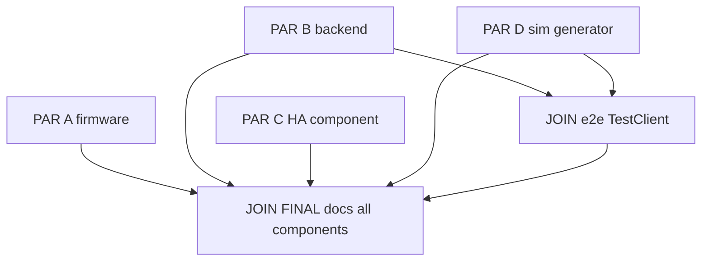
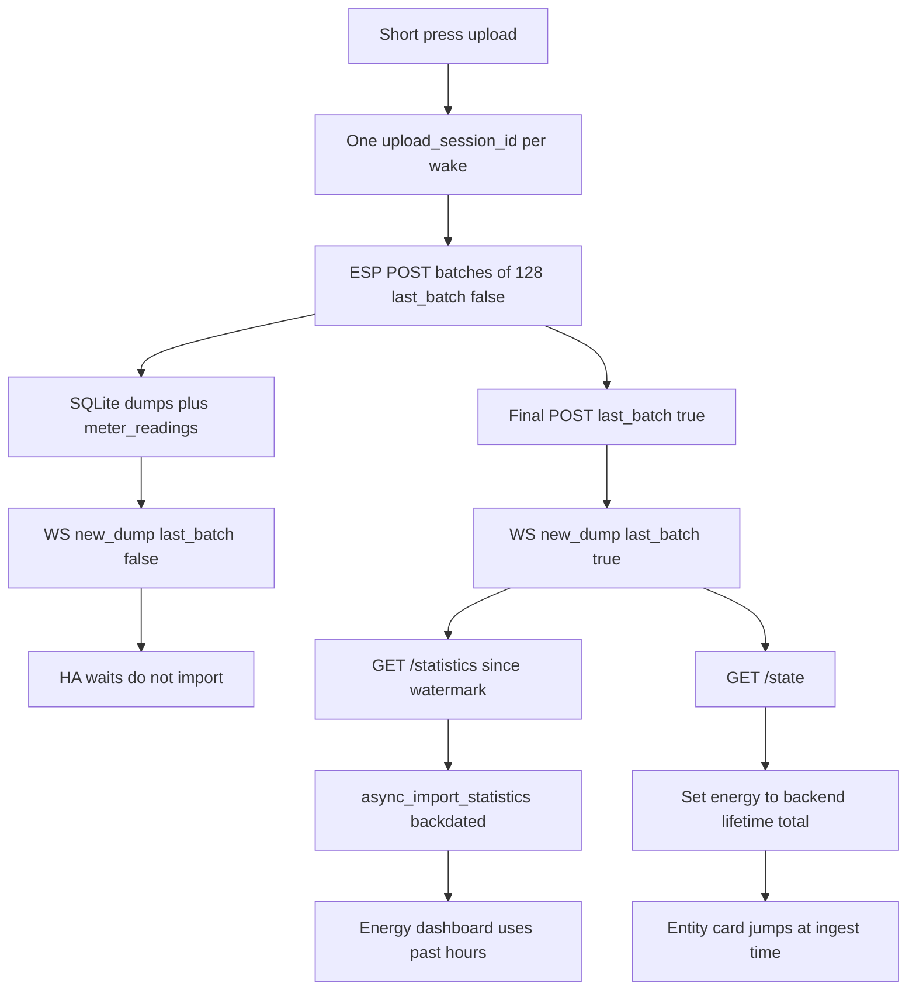
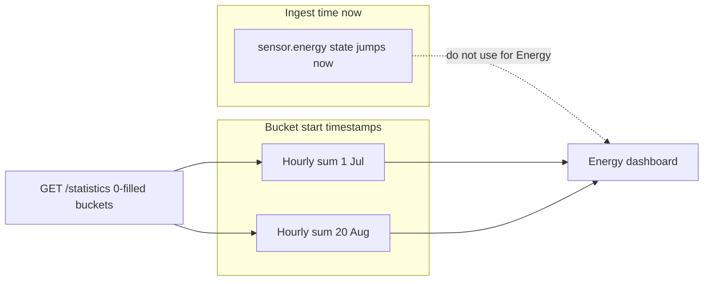

# Home Assistant integration (HACS)

HA **pulls** from the public backend. Firmware stays button-only (radio cadence unchanged). Delay until the upload button is accepted.

Do not have the backend call HA.

## Parallel workstreams

Subagents must not share files. The JSON/HTTP **contract below is frozen** — do not invent extra keys.

**No SEQ 0 subagent.** Creating `feature/hass-energy-integration` is a single parent shell command in the **same turn** as launching A–D. It is not splittable and not worth a serial phase. If A–D run in isolated worktrees, each branches from current HEAD itself — still no gate.



### Frozen contract (all streams)

Upload POST extras (optional on old dumps in DB; **required on new firmware POSTs**):

- `upload_session_id` — string, 1–64 chars, same for every POST in one wake
- `last_batch` — bool, `true` iff this POST is not truncated (`!UploadBatch.truncated`)

`POST /api/meter-buddy/upload` success unchanged: `{ok, dump_id, stored_readings}`.

WS `new_dump.dump` includes existing meta plus `upload_session_id`, `last_batch`.

HA-facing GET (Basic Auth):

- `GET /api/devices` → `[{device_id, last_seen, reading_count}]`
- `GET /api/devices/{device_id}/state` → `{device_id, energy_kwh, power_w, last_timestamp, meter_impulses_per_kwh, battery_v, battery_pct_est}`
- `GET /api/devices/{device_id}/statistics?since=&until=&bucket=hour|5min` → `{device_id, buckets: [{start, energy_kwh_sum, power_w_mean}]}` where `start` is UTC ISO-8601 bucket start, `energy_kwh_sum` is **lifetime cumulative at bucket end**, idle `power_w_mean` is `0`. Empty buckets after the first stored period are present (0-fill). No fill before first period.

Power formula: `(pulses / C) / (dt_s / 3600) * 1000` with `dt_s` from `period_start`→`timestamp` (default 60).

### File ownership (do not cross)

| Stream | Owns | Must not touch |
| --- | --- | --- |
| **PAR A firmware** | [src/upload.cpp](src/upload.cpp), [src/main.cpp](src/main.cpp), [include/upload.h](include/upload.h) | backend, `custom_components/`, `docs/`, `tools/` |
| **PAR B backend** | [backend/app/](backend/app/) (new `routes_devices.py`, stats in repository or `services/statistics.py`), [backend/tests/test_devices_api.py](backend/tests/test_devices_api.py), [backend/tests/test_statistics.py](backend/tests/test_statistics.py) | firmware, `custom_components/`, `tools/`, `docs/` |
| **PAR C HA** | [custom_components/meter_buddy/](custom_components/meter_buddy/) (entire tree, including HA unit tests), [hacs.json](hacs.json) | `backend/`, `src/`, `docs/` except nothing — no docs |
| **PAR D sim gen** | [tools/ha_catchup/](tools/ha_catchup/) (`generate.py`: sparse month → 128-row payloads with session id / `last_batch`) | app routes, firmware, HA component |
| **JOIN e2e** | [backend/tests/test_sim_ha_catchup.py](backend/tests/test_sim_ha_catchup.py) only | feature code unless a 1-line import fix |
| **JOIN FINAL docs** | [docs/](docs/) (SoT + index), [custom_components/meter_buddy/README.md](custom_components/meter_buddy/README.md), [tools/ha_catchup/README.md](tools/ha_catchup/README.md) | feature code (read-only against A–D + e2e) |

### Subagent briefs

**PAR A — firmware.** Generate `upload_session_id` once in `handleUploadWake`; pass into `buildBody` on every `HttpSession::post` of that loop. Emit `last_batch` from `!batch.truncated`. Empty heartbeat still gets both fields with `last_batch: true`. Keep existing keys. Diagnostics `dump` may omit session fields.

**PAR B — backend.** Accept new upload keys; store on `upload_dumps`. Implement devices/state/statistics + WS meta. 0-fill at 5-min/hour in SQL/Python, not 1-minute rows on the wire. Pytest: gaps → 0 W; three POSTs same session, `last_batch` only on last; `/statistics` `start` values are historical. Use TestClient JSON (do not wait for firmware).

**PAR C — HA.** Config flow; WS wait until `last_batch` (timeout ~60 s); then one `GET /statistics` + `GET /state`; `async_import_statistics` overwrite; live energy = absolute `/state.energy_kwh`. Mock aiohttp. Do not import on `last_batch: false`. First setup with no WS: fetch statistics immediately. `hacs.json` + README snippet in the component folder only (e.g. `custom_components/meter_buddy/README.md`).

**PAR D — generator.** Pure functions, no network. Input: start/end, impulses/kWh, sparsity. Output: list of upload JSON bodies matching the contract (128 cap, one session id, `last_batch` only on last). Pytest inside `tools/ha_catchup/` for chunking and flags only.

**JOIN e2e (after B + D).** `TestClient`: generator payloads → upload loop → assert WS flags → `/statistics` + `/state` → stub mapper asserts one import, historical bucket starts, idle hours 0, energy total matches generator.

**JOIN FINAL docs (after A–D + e2e).** Dedicated documentation subagent. Read the merged code; do not invent behavior. Update normative SoT **and** document every new component (checklist below).

## End-to-end flow

Firmware already POSTs at most 128 readings per request (`config::MaxUploadRecords`) and sets `UploadBatch.truncated` when more remain ([include/storage.h](include/storage.h), [src/upload.cpp](src/upload.cpp) `buildBody`). A month of data is many POSTs. HA **does not import until that wake is done**.

0-fill and aggregation happen **on the backend** at 5-minute and hourly grain (not a 1-minute grid on the wire).



Two clocks — a month of old data does **not** land on “today”:



## Firmware: session complete signal

Optional keys today are omitted, not `null`. `UploadPayload` uses `extra = forbid` ([backend/app/schemas/upload.py](backend/app/schemas/upload.py)), so new fields must be added to firmware **and** the schema.

In [src/upload.cpp](src/upload.cpp) `buildBody` / [src/main.cpp](src/main.cpp) `handleUploadWake`:

- `upload_session_id` — string, generated **once per upload wake** (e.g. 16 bytes hex from `esp_random()`), same value on every POST of that `HttpSession` loop. Empty heartbeat uses the same id with `last_batch: true`.
- `last_batch` — bool, `true` when `!batch.truncated` (no more unsynced records after this POST). Truncated batches send `false`.

Diagnostics `d` / `dump` preview may omit session fields or send a dummy id; it does not POST.

Radio policy, sleep, and button-only upload are unchanged.

## Backend APIs

Do **not** make HA walk `GET /dumps` + every dump JSON. Persist `upload_session_id` / `last_batch` on `upload_dumps` (from JSON). Document in [docs/api/upload.md](docs/api/upload.md).

- `GET /api/devices` — distinct `device_id`s + last dump time (config-flow picker).
- `GET /api/devices/{device_id}/state` — live snapshot: `energy_kwh` (sum of `pulses / dump C` over all readings), `power_w` from last stored period (same formula as [index.html](backend/app/templates/index.html) ~904–905), `last_timestamp`, battery, `meter_impulses_per_kwh`.
- `GET /api/devices/{device_id}/statistics?since=&until=&bucket=hour|5min` — **pre-aggregated** buckets with idle slots filled as **0 W / flat kWh**:
  - Do not fill before the first stored period.
  - Between first and last stored period in the requested window: missing 5-min/hour buckets exist and have `power_w_mean = 0`, energy `sum` = cumulative at bucket end (carry-forward).
  - Energy `sum` is **absolute lifetime kWh at bucket end**, not a delta to add onto HA’s previous state.
  - Paginate or cap with `since` so a month is ~720 hourly + ~8k five-minute rows, not 43k minutes.
- `GET /api/devices/{device_id}/readings?since=` — optional sparse debug; HA production path uses `/statistics`.

`/ws` `new_dump` meta includes `device_id`, `upload_session_id`, `last_batch`, `dump_id`, `reading_count`. No HA URL/token in backend env.

## One upload brings a month of old data

Example: ~30 days on the logger, user presses upload, HA already configured.

**What arrives**

- Sparse rows (minutes with pulses only). 128/POST → many dumps; firmware sends oldest unsynced first.
- Mid-session WS events have `last_batch: false`. HA **does not** import or jump live energy yet (avoids 300 partial Energy writes).
- Final POST: `last_batch: true`. One `GET /statistics?since=watermark` (both `bucket=hour` and `bucket=5min`, or one response with both) + one `GET /state`.

**If `last_batch` never arrives** (last POST failed): after a timeout (~60 s since last `new_dump` for that `upload_session_id`), import whatever is in SQLite anyway.

**First install** (month already in SQLite, no live session): do not wait; `GET /statistics` from the start, then set watermark.

**What HA does after `last_batch` (or timeout / first setup)**

1. Serial lock so two sessions cannot import at once.
2. Fetch statistics `since=watermark` (full range if rebuild).
3. `async_import_statistics` for the energy (and power) entity_id — **overwrite** `(statistic_id, start)`. Chunk if the list is large.
4. Set live energy = `/state.energy_kwh` (absolute). Set live power from `/state` (last period; 0 if that period is idle in the last stats bucket).
5. Persist `last_imported_period_ts` + `import_schema`.

**What the user sees**

| Surface | After a 1-month catch-up |
| --- | --- |
| Entity card | Energy **jumps once** when the session completes (e.g. 12 → 187 kWh). |
| Energy dashboard | Consumption on **original days/hours**. “Today” only gets periods that fall on today. |
| `sensor.energy` history graph | One step at session-complete time; Energy accounting uses statistics, not this graph. |

**Must not**

- Write tens of thousands of `states` (all stamp **now**).
- Add dump kWh onto the previous HA state.
- Import on every mid-session `new_dump`.

## HA component (install via HASS)

- [custom_components/meter_buddy/](custom_components/meter_buddy/) — domain `meter_buddy`
- [hacs.json](hacs.json) + install blurb (HACS custom repo, or copy into `/config/custom_components/`)

**Config flow:** backend URL, Basic auth, pick `device_id`. `unique_id` = `device_id`.

**Coordinator:** `/ws` Basic Auth; on `new_dump` for this device, if `last_batch` is false, only track `upload_session_id`; if true (or timeout), import `/statistics` under a lock. Poll every ~5–15 min as fallback (treat as complete snapshot).

**Entities** (Energy: Grid consumption → **energy sensor only**; no Riemann helper):

- Power (W) — `device_class: power`, `state_class: measurement`
- Energy (kWh) — `device_class: energy`, `state_class: total_increasing` — Meter Buddy observed lifetime, not the utility register
- Battery % — optional

Recorder: same `entity_id` after reinstall; overwrite stats; bump `import_schema` to force full rebuild if aggregation rules change. Orphan yaml sensors are not merged.

## Tests

Follow existing pytest layout ([backend/tests/](backend/tests/), [backend/tests/conftest.py](backend/tests/conftest.py)).

**Backend (pure + API)**

- Aggregation unit tests (no HTTP): sparse pulses with gaps → 5-min/hour buckets; idle buckets `power_w_mean == 0` and energy `sum` carried forward; no fill before first period; `since` cursor.
- Upload session API: three POSTs, 128 + 128 + remainder, same `upload_session_id`, `last_batch` only on the last; WS payload flags; `/state.energy_kwh` after each POST (partial vs complete); `/statistics` after last POST covers the full span with historical `start` times (not “now”).
- Heartbeat: empty `readings`, `last_batch: true` → no new statistic rows.
- Incomplete session: only `last_batch: false` dumps; statistics still computable for stored rows (timeout path).

**HA integration**

- Pure mapper: backend statistics JSON → `StatisticData` list (`start` in the past, `sum` absolute).
- Coordinator: ignore `last_batch: false`; one import on `last_batch: true`; timeout triggers import; rebuild overwrites; live state uses `/state` total, not previous + delta.
- Use mocked aiohttp/backend; add `pytest-homeassistant-custom-component` only if config-flow tests need a real `hass` fixture.

## Simulator: firmware-like upload through to HA import

PAR D owns [tools/ha_catchup/](tools/ha_catchup/) (no HTTP). JOIN e2e wires it to FastAPI `TestClient`. Do not change [hass_sim/](hass_sim/) (opposite direction).

Procedure it must reproduce:

1. Generate a sparse month (1-minute periods, omit zero-pulse minutes like firmware).
2. Chunk into 128-row batches; one `upload_session_id`; `last_batch` only on the final POST (and a trailing empty heartbeat optional).
3. `POST /api/meter-buddy/upload` with HTTP Basic (TestClient in pytest, or live URL).
4. Subscribe to `/ws` (or drain TestClient events); assert mid-session `last_batch` is false.
5. After the last POST: `GET /statistics` + `GET /state`.
6. **HA stub**: build the exact `async_import_statistics` payload the integration would send. Assert bucket `start` values lie in the generated month, **not** ingest time; idle hours are 0 W; live energy equals sum of all generated kWh; one import after complete, not per batch.

Wire this as a pytest e2e (`test_sim_ha_catchup.py`) using FastAPI `TestClient` so CI does not need Docker or a real HA. The script’s CLI can target a running Docker backend for manual month-scale runs.

Optional later: `--ha-url` + long-lived token against a lab HA — not required for CI.

## JOIN FINAL: document all new components

**Last step after A–D and e2e.** Spawn one dedicated docs subagent (per workspace SoT rule). Brief shape:

```text
Feature change summary: HACS Meter Buddy energy sensors; upload session
complete; backend /statistics 0-fill; catch-up sim.
Code touched: firmware session fields; backend devices API; custom_components;
tools/ha_catchup; e2e test.
Update normative docs to match code. Document every new component below.
Do not invent behavior not in code. Cite what you changed.
Ignore docs/archive/ except as historical reference.
```

### Checklist the docs subagent must cover

| Component | Doc target |
| --- | --- |
| Upload session fields (`upload_session_id`, `last_batch`) | [docs/api/upload.md](docs/api/upload.md), [docs/firmware/fw_specification.md](docs/firmware/fw_specification.md) |
| HA consumer requirement | [docs/intent_spec.md](docs/intent_spec.md) (requirements only) |
| `GET /api/devices`, `/state`, `/statistics`, WS meta | [docs/api/upload.md](docs/api/upload.md) |
| HACS custom integration (install, config flow, entities, Energy setup, wait-for-`last_batch`) | [custom_components/meter_buddy/README.md](custom_components/meter_buddy/README.md); index link in [docs/README.md](docs/README.md) |
| Catch-up generator | [tools/ha_catchup/README.md](tools/ha_catchup/README.md) (how to generate payloads / run with pytest) |
| E2E sim path | Short section in tools README or docs README pointing at `test_sim_ha_catchup.py` |
| Docs index | [docs/README.md](docs/README.md) — living-docs table entry for HA integration |

Ignore `docs/archive/`.

## Branch and scope

- Parent (same turn as spawn A–D): `git checkout -b feature/hass-energy-integration` if not already on it. Not a subagent.
- Launch PAR A–D in parallel with the file ownership table (no overlapping edits).
- Then JOIN e2e, then **JOIN FINAL docs** (all new components).
- Out of scope: firmware auto-upload / always-on radio, MQTT, ESPHome, backend→HA push, changing [hass_sim/](hass_sim/) direction.
