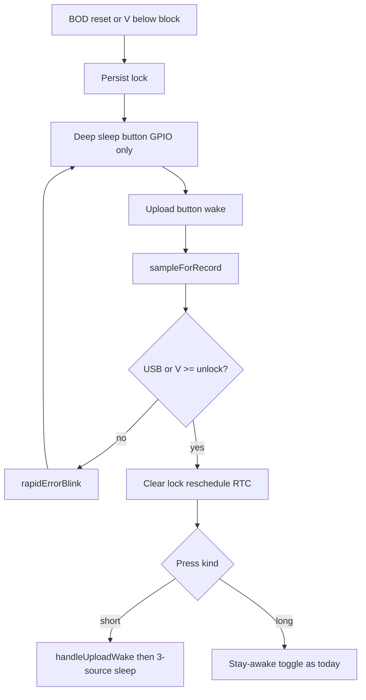

# Handle brownout (button-only protection sleep)

## Problem

The XIAO LDO dies when `BAT+` sags near **3.3 V + dropout** (often **~3.45–3.60 V under Wi‑Fi**), not at the OCV table’s 3.30 V floor. Pulse and RTC wakes still cost energy; Wi‑Fi after a bounced resting voltage causes a brown-out loop. RTC RAM is wiped on BOD, so the lock must live in flash.

**Protection mode (this revision):** brown-out **or** low battery → deep sleep with **only the upload button** as a wake source. Pulse and RTC GPIO wakes are **not armed**. Normal operation returns only after a button wake sees pack voltage **at or above unlock hysteresis** (USB power also counts as recovered).

Pulses that arrive while locked are **not counted** (intentional Q-2 / W-1 exception). Resume requires a button press after the cell recovers — there is no RTC poll to notice charge unattended.

Keep the ESP32-C3 BOD enabled (protects flash). Onboard ETA4054 has no CHRG GPIO.

## Policy

Enter lock when:

- `esp_reset_reason() == ESP_RST_BROWNOUT` (always latch, even if bounced V is above `V_block`), or
- a resting sample (RTC roll, upload, cold boot, diagnostics) has `V < BatteryRadioBlockVolts`

While locked:

| Action | Behavior |
| --- | --- |
| Deep sleep | Arm **only** `UploadButtonPin` (D1). Do **not** arm pulse or RTC GPIOs |
| DS3231 | Clear / disable Alarm1 so SQW is not stuck LOW for later restore |
| Pulse / RTC wakes | Cannot occur (not armed) |
| Button wake, still low | `rapidErrorBlink`; no Wi‑Fi / upload / stay-awake; sleep button-only again |
| Button wake, recovered | Clear lock; `scheduleNextWakeAlarm`; then **honor the same press** (short → upload, long → stay-awake toggle) |
| Stay-awake flash flag | Ignored until unlocked (unless USB is powering the board) |

Unlock hysteresis (compile-time in [`include/config.example.h`](include/config.example.h) / `local_config.h`):

- `BatteryRadioBlockVolts = 3.55` — enter lock at/below this resting sample
- `BatteryRadioUnlockVolts = 3.80` — leave lock only at/above this

USB plugged (`Serial.isPlugged()`): treat as powered — do not enter lock; if already locked, unlock (3V3 is USB-fed). Field restore without a PC still needs the button after charge, using voltage hysteresis.

## Git workflow

All work lands on **`feature/brownout-protection`**, created from **`main`** (fetch/fast-forward `main` first if it has a remote). Do not commit or open a PR unless asked.

Order on that branch: lock storage → button-only sleep → button restore → upload errors → SoT docs subagent.

## Implementation

### 1. Lock state

[`include/battery.h`](include/battery.h) / [`src/battery.cpp`](src/battery.cpp) + [`src/storage.cpp`](src/storage.cpp):

- Persist `/brownout.dat` (LittleFS); load in `storage::begin()`
- `noteResetReason()` latches on `ESP_RST_BROWNOUT`
- `evaluateProtectionLock(float volts)` applies block / unlock vs USB
- `protectionLocked()` for sleep-arming and `setup` dispatch

No `esp_brownout_disable`.

### 2. Button-only `enterDeepSleep`

Today [`enterDeepSleep()`](src/main.cpp) always arms D1 + D3 + D2. Change it to:

- If `protectionLocked()`: arm **only** `1ULL << UploadButtonPin`; skip pulse-pin HIGH wait (pulse is not a wake); still `waitForUploadButtonRelease`
- Else: current three-source arm + pulse settle

On **entering** lock (RTC/cold/upload sample too low, or BOD boot): `rtc_clock` clear alarm, persist flag, `enterDeepSleep()`.

### 3. Button wake restores or refuses

Button path already classifies short vs long **before** heavy init. After `initSubsystems` + sample:

- If still locked: skip upload and stay-awake; error blink; button-only sleep
- If this sample unlocks: persist clear, `rtc_clock::begin()` + `scheduleNextWakeAlarm()`, then run the already-classified action; later sleep arms all three GPIOs

Detect low-V **during normal RTC** ([`handleRtcWake`](src/main.cpp)): roll the open period first (last commit), then latch and button-only sleep. Pulse path stays lean (no ADC); lock is entered from RTC, upload, BOD, or diagnostics.

Diagnostics / stay-awake: if a sample drops below block and USB is not plugged, latch and button-only sleep (do not keep the REPL draining the cell).

### 4. Operator / backend visibility

Backend [`UploadPayload`](backend/app/schemas/upload.py) is `extra=forbid` — no new top-level keys. On the **next successful POST after unlock**, attach `errors[]`:

- `low_battery` — lock entered from voltage
- `brownout_lock` — lock entered from `ESP_RST_BROWNOUT`

Map messages in [`src/upload.cpp`](src/upload.cpp). Document in [`docs/api/upload.md`](docs/api/upload.md). Diagnostics `status`: lock + reset reason.

A refused button press while still locked never reaches the network; LED is the immediate signal.

### 5. Specs (spawn SoT subagent after code)

- [docs/intent_spec.md](docs/intent_spec.md): protection mode is an explicit exception to W-1 / Q-2 (no pulse or housekeeping wakes until a button sample clears hysteresis). Q-5 still covers unattended LittleFS survival; **resume after charge requires a button press**.
- [docs/firmware/fw_specification.md](docs/firmware/fw_specification.md): **US-11**; `enterDeepSleep` arm table; RTC alarm cleared while locked; boot dispatch
- [docs/api/upload.md](docs/api/upload.md): the two error codes

## Out of scope

- ETA4054 CHRG or VBUS divider hardware
- Changing the OCV % table
- Disabling BOD
- Counting pulses while locked

## Acceptance

- After BOD or `V < 3.55`, device sleeps; pulse and RTC do **not** wake it
- Upload button still wakes; if still below 3.80 V and no USB: error blink, no Wi‑Fi, button-only sleep
- After charge, button wake with `V >= 3.80` (or USB): pulse + RTC wakes restored; short press uploads as usual
- Stale RTC alarm does not immediately re-wake after restore (alarm cleared while locked, rescheduled on unlock)
- Unacked LittleFS records remain; next allowed upload may include `brownout_lock` / `low_battery`
