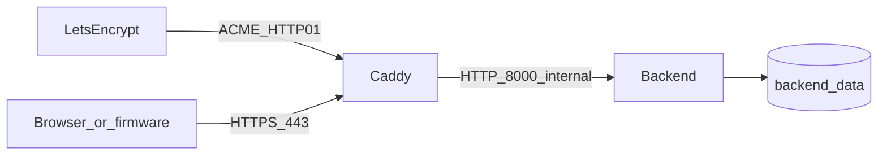

# Harden backend for public HTTPS (Let’s Encrypt only)

## Goals

- Container image unsuitable for running as root / shipping test deps
- **Every** HTTP and WebSocket route requires the same Basic Auth used by upload
- Compose publishes **HTTPS** via Caddy with **automatic Let’s Encrypt only** (no self-signed / local CA path)
- Document pinning **ISRG Root X1** in firmware `TlsCaCert`

## Prerequisites (documented, not automated)

- A public DNS name pointing at the host (`A`/`AAAA`)
- Inbound TCP **80** and **443** reachable for ACME HTTP-01
- Compose env `METER_BUDDY_DOMAIN` (e.g. `meter.example.com`) — required for the Caddy site address

## 1. Dockerfile hardening

Rewrite [`backend/Dockerfile`](backend/Dockerfile):

- Prefer single slim stage with **prod-only** deps
- Split deps: runtime in [`backend/requirements.txt`](backend/requirements.txt); move `pytest` / `httpx` to [`backend/requirements-dev.txt`](backend/requirements-dev.txt) (CI/`pytest` install both)
- Do **not** `COPY tests/` into the image
- Create non-root user (`app` / uid 10001), `chown` `/app` and `/data`, `USER app`
- `ENV PYTHONDONTWRITEBYTECODE=1 PYTHONUNBUFFERED=1`
- `HEALTHCHECK` against unauthenticated `/healthz` (not `/`)
- Keep auth secrets out of image `ENV`

## 2. Auth on all routes + secure-password gate

Today only [`routes_upload.py`](backend/app/api/routes_upload.py) uses `require_basic_auth`. Apply it to:

| Area | File | Notes |
| --- | --- | --- |
| Index | [`routes_pages.py`](backend/app/api/routes_pages.py) | Browser Basic Auth dialog |
| Dumps | [`routes_dumps.py`](backend/app/api/routes_dumps.py) | All GET/DELETE |
| DB admin | [`routes_db.py`](backend/app/api/routes_db.py) | GET/POST/DELETE `/db` |
| Upload | already done | — |
| WebSocket | [`routes_ws.py`](backend/app/api/routes_ws.py) | Validate `Authorization: Basic …` on upgrade; reject if missing/invalid |

Add `/healthz` **without** auth (Docker/Caddy health only).

Disable OpenAPI UI unless `METER_BUDDY_ENABLE_DOCS=1`.

Startup gate: refuse to start if `METER_BUDDY_AUTH_PASSWORD` is missing, empty, or `change-me`, unless `METER_BUDDY_ALLOW_INSECURE_AUTH=1` (tests/local venv only; **not** in Compose).

Update tests for auth on formerly open routes; update [`script/sync_db_from_remote.py`](script/sync_db_from_remote.py) for Basic Auth.

## 3. Compose: Caddy automatic Let’s Encrypt only

Rewrite [`backend/docker-compose.yml`](backend/docker-compose.yml):



- **`caddy`**: `caddy:2-alpine`, ports `80:80` and `443:443`, mounts `Caddyfile` + persistent `caddy_data` (and `caddy_config` if needed for Caddy 2). **No** `./certs` mount, **no** self-signed helper script.
- **`backend`**: build Dockerfile; **no** host `ports:`; internal network only; auth + DB env; `/data` volume; `read_only: true` + tmpfs `/tmp`; `cap_drop: [ALL]`; `no-new-privileges`; no `ALLOW_INSECURE_AUTH`
- Require `METER_BUDDY_AUTH_PASSWORD` from the environment (no `change-me` default)
- Pass `METER_BUDDY_DOMAIN` into Caddy (Compose variable substitution in Caddyfile, or a tiny entrypoint that renders the site name)

[`backend/Caddyfile`](backend/Caddyfile):

```caddy
{$METER_BUDDY_DOMAIN} {
  reverse_proxy backend:8000
}
```

Caddy’s default automatic HTTPS obtains and renews Let’s Encrypt certificates for that hostname. Port 80 is used for ACME + redirect to HTTPS. Do **not** add `tls internal`, file-based `tls` cert paths, or mkcert/self-signed flows.

## 4. Firmware TLS: handle Let’s Encrypt renewal without reflashing

### Why `TlsCaCert` does not need updating on each LE roll

Let’s Encrypt renews the **server leaf** (~every 60 days) and may rotate **intermediates** (R3 → R10/R11, etc.). Caddy renews those automatically. Firmware must **not** pin the leaf or intermediate.

`WiFiClientSecure::setCACert` trusts a **CA** and validates the presented chain against it. Put the long-lived **ISRG root(s)** in [`TlsCaCert`](include/local_config.h) / [`config.example.h`](include/config.example.h):

| What rotates | Who handles it | Firmware action |
| --- | --- | --- |
| Leaf (your hostname cert) | Caddy + Let’s Encrypt | None |
| Intermediate | Let’s Encrypt / Caddy chain | None (still chains to ISRG root) |
| ISRG Root X1 / X2 | Extremely rare (years–decades) | Flash updated PEM if LE ever stops chaining to the pinned root |

Recommended default: **vendor** ISRG Root X1 + X2 in-repo (public data, not a secret) and point `TlsCaCert` at that constant so nobody pastes PEMs into gitignored `local_config.h`.

### Auto-fill vs vendor (chosen approach)

Yes, a PlatformIO `extra_scripts` step *could* download the PEMs and rewrite `local_config.h` — but that is a bad fit: `local_config.h` is gitignored credentials, builds become network-dependent, and the rewrite fights hand-edited secrets.

**Do this instead** (reproducible, offline-friendly):

1. Commit [`include/certs/isrg_roots.h`](include/certs/isrg_roots.h) (or `.inc`) containing:
   ```cpp
   constexpr const char *IsrgRootCerts = R"EOF(
   -----BEGIN CERTIFICATE-----
   ... X1 ...
   -----END CERTIFICATE-----
   -----BEGIN CERTIFICATE-----
   ... X2 ...
   -----END CERTIFICATE-----
   )EOF";
   ```
2. In [`config.example.h`](include/config.example.h) (and document for existing `local_config.h`):
   ```cpp
   #include "certs/isrg_roots.h"
   constexpr const char *TlsCaCert = IsrgRootCerts;
   ```
3. Optional maintainer script `script/refresh_isrg_roots.py` (curl from letsencrypt.org → regenerate the header) — run rarely when roots change, not every firmware build.

Users only set `UploadUrl` / Basic Auth / Wi‑Fi in `local_config.h`; TLS trust comes from the committed roots by default. Override `TlsCaCert` only if pinning something else.

**How to refresh the vendored roots** (maintainers):

```bash
curl -fsSL -o isrgrootx1.pem https://letsencrypt.org/certs/isrgrootx1.pem
curl -fsSL -o isrg-root-x2.pem https://letsencrypt.org/certs/isrg-root-x2.pem
# then regenerate include/certs/isrg_roots.h (script or manual)
```

Index: https://letsencrypt.org/certificates/

Do **not** use `AllowInsecureTls = true` for production.

### README guide

Extend [`backend/README.md`](backend/README.md) (+ short note in root README config section):

1. DNS → host; set `METER_BUDDY_DOMAIN` + strong `METER_BUDDY_AUTH_PASSWORD`; `docker compose up --build -d`
2. Confirm `https://$METER_BUDDY_DOMAIN/` prompts for Basic Auth
3. In `include/local_config.h`: set `UploadUrl`, Basic Auth, Wi‑Fi; keep `TlsCaCert = IsrgRootCerts` (via `#include "certs/isrg_roots.h"`) and `AllowInsecureTls = false`
4. Flash; LE leaf renewals need no firmware change; root updates are a rare repo bump + reflash

Update [`docs/api/upload.md`](docs/api/upload.md): all routes Basic Auth except `/healthz`. Spawn SoT subagent after code.

## Out of scope

- Self-signed / private CA / mounted PEM files
- OAuth/JWT
- TLS inside uvicorn
- Mutating `local_config.h` from the PlatformIO build
- Shipping the full Mozilla CA bundle (ISRG roots are enough for LE)
- Firmware protocol changes beyond defaulting `TlsCaCert` to vendored ISRG roots
