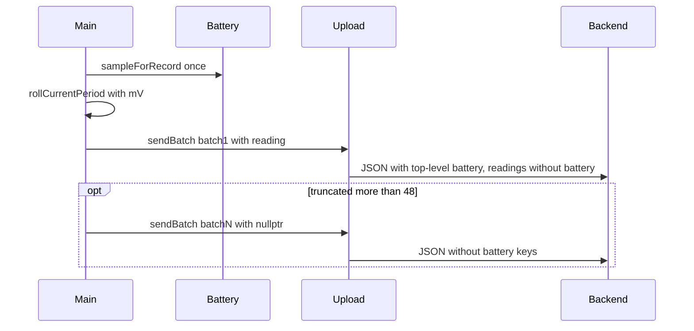

# Optional battery on first upload batch only

## Goal

Firmware stops sending per-reading `battery_v` / `battery_pct_est`. During an upload wake it samples the ADC **once**, rolls the open period with that mV, and includes top-level battery fields **only on the first** `sendBatch` POST. Follow-up POSTs (when `truncated` and more than 48 unsynced records) omit those keys. Backend already accepts omission; docs and dump-list meta need to match.

## Firmware

### One sample on upload wake — [`src/main.cpp`](src/main.cpp)

Replace the two `sampleForRecord()` calls in `handleUploadWake()` with one:

```cpp
const auto reading = battery::sampleForRecord();
storage::rollCurrentPeriod(currentTimestamp(),
                           static_cast<uint16_t>(reading.volts * 1000.0f));
bool includeBattery = true;
while (true) {
  // ...
  upload::sendBatch(batch, includeBattery ? &reading : nullptr);
  includeBattery = false;
  // ...
}
```

RTC wake still samples independently (local `batteryMv` storage unchanged; not on the wire).

### Optional top-level in JSON builder — [`include/upload.h`](include/upload.h), [`src/upload.cpp`](src/upload.cpp)

- Change `buildBody` / `sendBatch` to take `const battery::Reading *batteryReading` (nullptr = omit top-level fields).
- When non-null, emit `"battery_v"` / `"battery_pct_est"` as today.
- When null, skip those keys entirely.
- Stop emitting per-reading battery fields; readings are `timestamp`, `period_start`, `pulses` only.
- Diagnostics `dump` keeps `buildBody(batch, &sample)` so preview still shows live top-level battery.

## Backend

Schema in [`backend/app/schemas/upload.py`](backend/app/schemas/upload.py) already has both fields optional — no model change required.

### Dump list meta — [`backend/app/db/repository.py`](backend/app/db/repository.py)

`list_dumps` / `get_dump_meta` currently take battery from the last `meter_readings` row. After this change that will be null for new firmware uploads. Switch to top-level from `raw_json`:

```sql
json_extract(d.raw_json, '$.battery_v') AS battery_v,
json_extract(d.raw_json, '$.battery_pct_est') AS battery_pct_est
```

Follow-up batches without top-level battery correctly show null in the index (acceptable).

### Tests — [`backend/tests/`](backend/tests/)

- Assert upload with **no** top-level and **no** per-reading battery is `201`.
- Update [`test_db_endpoints.py`](backend/tests/test_db_endpoints.py) so list meta expects top-level `json_extract` (payload with top-level battery, readings without).
- Keep existing heartbeat-with-battery coverage.

UI charts that plot per-reading battery already gate on `readings.some(...)`; they simply hide when fields are absent — no UI change required.

## Docs (via SoT subagent after code)

Update normative docs to match:

- [`docs/api/upload.md`](docs/api/upload.md) — example without per-reading battery; note top-level only on first batch of a multi-POST session; firmware may omit keys.
- [`docs/firmware/fw_specification.md`](docs/firmware/fw_specification.md) — one `sampleForRecord()` on upload; top-level only on first POST; readings JSON without battery.

`intent_spec` M-3/W-3 stay as local roll-time battery condition (still stored in `ReadingRecord.batteryMv`); no intent change.


