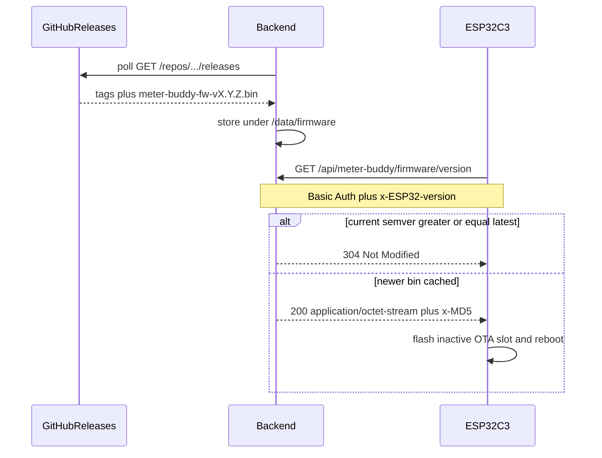

# OTA firmware refresh (GitHub release mirror)

Firmware already has the client: after a successful upload with readings, [`upload::checkFirmwareUpdate()`](src/upload.cpp) GETs `config::FirmwareVersionUrl` via Arduino `HTTPUpdate` (binary-or-304, not JSON). Dual OTA slots exist in [`partitions.csv`](partitions.csv). CI already publishes `meter-buddy-fw-vX.Y.Z.bin` to [GitHub Releases](https://github.com/bakroistvan/meter_buddy/releases/tag/v0.4.0).

The device **cannot** download those assets from GitHub itself: firmware pins Let’s Encrypt ISRG roots, while GitHub uses a different CA. The backend (same host/cert as upload) must **mirror** release `.bin` files and speak the `HTTPUpdate` protocol.

Work on a new branch: `feat/ota-firmware-refresh`.

## 1. Backend: mirror GitHub releases

New service [`backend/app/services/firmware_mirror.py`](backend/app/services/firmware_mirror.py):

- Poll `https://api.github.com/repos/{owner}/{repo}/releases` on **startup** and on an interval (default **1 day**).
- Default repo: `bakroistvan/meter_buddy` (env-overridable). `METER_BUDDY_GITHUB_TOKEN` is optional for a public repo (unauthenticated GitHub API is 60 req/hour) but **recommended**; a dedicated operator guide covers creating and installing it.
- Skip drafts and prereleases.
- For each release, download the app image whose name matches `meter-buddy-fw-v*.bin` and is **not** `*-partitions.bin`. Ignore `.elf`.
- Persist under the existing writable Docker volume: `/data/firmware/` (SQLite already lives on `/data`; the backend container is `read_only` except that mount).
- Keep a small `manifest.json` (tag, published_at, filename, size, md5). Device OTA never waits on GitHub — serve the last successful cache; if the cache is empty, return 503 so `HTTPUpdate` fails closed.

Env (add to [`backend/.env.example`](backend/.env.example)):

- `METER_BUDDY_GITHUB_REPO` (default `bakroistvan/meter_buddy`)
- `METER_BUDDY_GITHUB_TOKEN` (optional)
- `METER_BUDDY_FIRMWARE_DIR` (default `/data/firmware` in Docker, `backend/data/firmware` locally)
- `METER_BUDDY_FIRMWARE_SYNC_INTERVAL_SEC` (default `86400`)

Use stdlib `urllib` in a thread so [`backend/requirements.txt`](backend/requirements.txt) stays unchanged. Lifespan in [`backend/app/main.py`](backend/app/main.py) starts the periodic task and cancels it on shutdown. Send `Authorization: Bearer <token>` when the env var is set, plus a `User-Agent` GitHub requires.

## 2. GitHub token setup guide

New operator how-to [`backend/GITHUB_TOKEN.md`](backend/GITHUB_TOKEN.md), linked from [`backend/README.md`](backend/README.md) and `.env.example`. Not a product spec — step-by-step for the home-server `.env`.

Cover:

1. **Why** — daily poll + startup + manual sync stay well under 60 req/hour on a public repo, but a token avoids rate-limit 403s, raises the quota to 5,000/hour, and is required if the repo is private.
2. **Create a fine-grained PAT** (preferred over classic):
   - GitHub → Settings → Developer settings → Personal access tokens → Fine-grained tokens → Generate.
   - Resource owner: the repo owner (`bakroistvan`); Repository access: only `meter_buddy`.
   - Permissions: **Contents: Read-only** (release asset download); Metadata is implied. No Contents write, no repo admin.
   - Set an expiry; rotate by replacing the value in `.env`.
3. **Install on the backend host** — add `METER_BUDDY_GITHUB_TOKEN=...` to `backend/.env` (never commit `.env`). `docker compose up -d` / restart the `backend` service so Compose injects it.
4. **Check** — `POST /api/meter-buddy/firmware/sync` with Basic Auth should succeed; `GET /api/meter-buddy/firmware` shows mirrored tags. A 403/401 from GitHub in last-sync error means the token or repo permission is wrong.

## 3. Backend: HTTPUpdate endpoint

New router [`backend/app/api/routes_firmware.py`](backend/app/api/routes_firmware.py), **Basic Auth** (intent N-5: only `/healthz` is unauthenticated).

**Device (keep the URL firmware already uses):** `GET /api/meter-buddy/firmware/version`

This is **not** a JSON version document. Arduino `HTTPUpdate.update(client, url, currentVersion)` does one GET and expects:

| Condition | Response |
| --- | --- |
| `x-ESP32-version` (strip leading `v`, parse `X.Y.Z`) **>=** latest mirrored tag | `304 Not Modified` |
| Latest `.bin` is newer | `200` + `Content-Type: application/octet-stream` + `Content-Length` + `x-MD5` (hex) + raw bytes |
| No cached image | `503` |

No downgrades. Unparseable device version is treated as older than latest so a stale `"1.0.0"` in `local_config.h` can still pick up a real tagged build — **unless** we inject version at compile time (section 5), in which case comparison stays strict semver. Plan: **inject at build**, compare strictly, document one USB flash for units still reporting a dummy `1.0.0`.

**Operator (same auth):**

- `GET /api/meter-buddy/firmware` — list mirrored tags, sizes, md5, last sync time/error
- `POST /api/meter-buddy/firmware/sync` — pull GitHub now (so a new tag does not wait for the daily poll)

Bump Caddy `reverse_proxy` read timeout in [`backend/Caddyfile`](backend/Caddyfile) (e.g. 120s) so a ~1 MB download over a phone hotspot is not cut off.

Tests in `backend/tests/test_firmware.py`: mock GitHub HTTP, 401 without auth, 304 when current == latest, 200 + matching md5 when older, 503 when empty cache.

## 4. Firmware client gaps

[`src/upload.cpp`](src/upload.cpp) `checkFirmwareUpdate()` today does not send Basic Auth and uses the default `HTTPUpdate` timeout (~8s), which is too short for a 1 MB image.

- `httpUpdate.setAuthorization(config::BasicAuthUser, config::BasicAuthPassword)`
- `httpUpdate.setTimeout(...)` using a new `config::OtaTimeoutMs` (default **120000**) in [`include/config.example.h`](include/config.example.h)
- Pass the **build-injected** version string (section 5), not a stale `local_config.h` constant

Keep the existing trigger in [`src/main.cpp`](src/main.cpp) (OTA only after a successful upload that synced readings; Wi‑Fi still up).

## 5. Embed git tag as `FirmwareVersion`

OTA comparison is wrong if `config::FirmwareVersion` stays a manual `"1.0.0"`. CI already names artifacts from the git tag; the binary should report the same string.

- Add [`script/pio_firmware_version.py`](script/pio_firmware_version.py) as a PlatformIO `extra_script` that `-DFIRMWARE_VERSION=\"<git describe --tags --always>\"` (tag name on `v*` builds).
- In `checkFirmwareUpdate`, use `FIRMWARE_VERSION` when defined, else `config::FirmwareVersion`.
- Leave `config::FirmwareVersion` as a documented fallback for builds without git.
- Update the [README](README.md) release checklist: stop asking operators to bump the constant by hand.

## 6. Docs (via spec subagent after code)

Normative updates (workspace rule):

- New [`docs/api/firmware.md`](docs/api/firmware.md) — HTTPUpdate contract, headers, 304 vs 200, auth, mirror behavior
- [`docs/firmware/fw_specification.md`](docs/firmware/fw_specification.md) — US-10: Basic Auth, timeout, injected version, `FirmwareVersionUrl`
- [`docs/intent_spec.md`](docs/intent_spec.md) — N-5 acceptance should list the firmware routes as authenticated
- [`backend/README.md`](backend/README.md) + `.env.example` — mirror env vars, operator endpoints, and a link to the token guide

The GitHub token how-to ([`backend/GITHUB_TOKEN.md`](backend/GITHUB_TOKEN.md)) is written on the feature branch with the code, not by the spec subagent.

## Out of scope

- Operator HTML UI for firmware (JSON list/sync is enough)
- GitHub webhooks (home server poll + manual `POST .../sync` is enough)
- Serving `.elf` / `partitions.bin` over OTA (USB flash remains primary; OTA uses the app `.bin` only)
- Changing when OTA runs (still post-upload with readings only)
