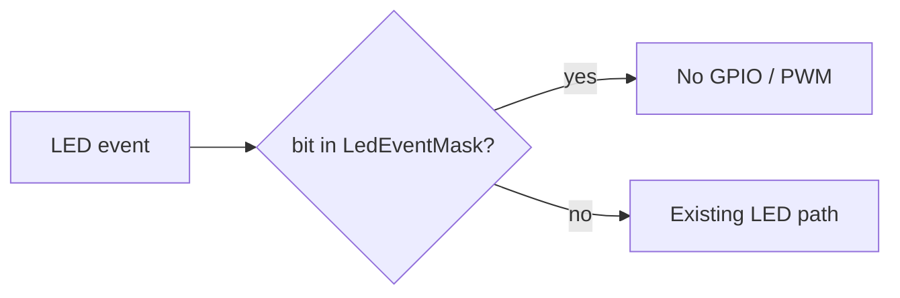

# Production-ready LED mask and docs

Routine LEDs cannot be turned off today: every pulse wake flashes D8, every RTC roll blinks D10, and every wake starts dim PWM on D10. That burns energy on a sleeping field device. User-action LEDs (upload in progress, errors, stay-awake toggle) stay visible.

## Firmware: `LedEventMask`

Add a compile-time mask in [`include/config.example.h`](include/config.example.h) (and document it for `local_config.h`):

```cpp
namespace led_event {
constexpr uint8_t Awake   = 1 << 0; // dim PWM idle-awake
constexpr uint8_t RtcRoll = 1 << 1; // status blink on period roll
constexpr uint8_t Pulse   = 1 << 2; // D8 ~100 ms per accepted pulse
}
// Bits set here are suppressed. 0 = show all (bench).
constexpr uint8_t LedEventMask =
    led_event::Awake | led_event::RtcRoll | led_event::Pulse;
```

Default **masks** those three events so a build without a custom `local_config.h` is production-quiet. Bench/dev unmasks with `LedEventMask = 0`.

Helper (inline in config or a tiny `led_events.h`): `ledEventEnabled(bit)` → true when the bit is **not** in the mask. Use `if constexpr` at the pulse ISR so the compiler can drop `digitalWrite` + timer reset.

**Gating (what is suppressed vs kept):**

| Event | Code | When masked |
| --- | --- | --- |
| Idle awake | `AwakeLed::setAwake()` | No dim PWM; write off (so post-upload restore does not leave full-on after `setOn`/`doubleBlink`) |
| RTC roll | `awakeLed.blink()` in `handleRtcWake` | Skip the one-shot blink |
| Pulse | ISR + `handlePulseWake` D8 flash | Skip HIGH + off-timer / 100 ms delay |
| Upload blink | `startPulseBlink` | **Unchanged** |
| Errors | `rapidErrorBlink` | **Unchanged** |
| Stay-awake toggle | `setOn` + `doubleBlink` | **Unchanged**; following `setAwake()` still respects the Awake bit |

[`include/awake_led.h`](include/awake_led.h) owns Awake/RtcRoll gating so [`src/main.cpp`](src/main.cpp) stays a few pulse-LED `if constexpr` checks. `setSleep()` always runs so pins go pulldown before deep sleep.

Skip creating the pulse-LED FreeRTOS timer when Pulse is masked (compile-time).



## Docs: make [`docs/README.md`](docs/README.md) operator-facing

Rewrite from an agent index into a **production config + documentation map**:

- Drop the “Agent entry point” opener (keep a one-line pointer to [`AGENT.md`](AGENT.md) at the bottom or under a short “For agents” note).
- New **Production firmware config** section: copy `config.example.h` → gitignored `local_config.h`; required secrets/URLs; production knobs (`EnableDeepSleep=true`, `StayAwakeBoot=false`, `AllowInsecureTls=false`, `KeepWifiConnectedWhenAwake=false`, recommend `EnableSerialLogs=false`, **`LedEventMask` masks Awake/RtcRoll/Pulse**); what still lights (upload / error / stay-awake).
- Keep the SoT table, living docs, package READMEs, and a shorter archive pointer.

Do **not** flip `EnableSerialLogs` default in example.h (first-flash debug still useful); only recommend false in the production section.

## SoT after the behavior change

Per workspace rule, spawn a dedicated docs subagent to align:

- [`docs/intent_spec.md`](docs/intent_spec.md) — U-6: indicators remain distinguishable when unmasked; production may mask routine awake/RTC/pulse LEDs (same pattern as D-4 serial logs).
- [`docs/firmware/fw_specification.md`](docs/firmware/fw_specification.md) — US-1/US-3/US-8 and the config-knobs table: pulse flash, RTC blink, and dim awake are skipped when those bits are masked.

Light touch on [`AGENT.md`](AGENT.md) / root [`README.md`](README.md) LED one-liners so they do not contradict the mask.