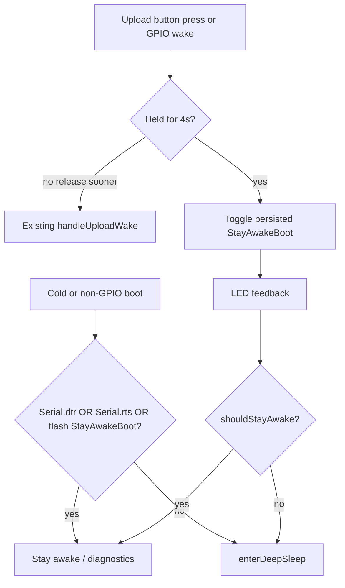

# StayAwakeBoot rename + long-press toggle + DTR/RTS debug stay-awake

## Behavior

- **Short press** (&lt; 4s, then release): current upload flow unchanged.
- **Long press** (≥ 4s while held LOW): toggle persisted `StayAwakeBoot`, show LED feedback, do **not** upload.
  - Stay-awake ON → solid/brief on + `doubleBlink`
  - Stay-awake OFF → `rapidErrorBlink` (or off after blink)
- **`Serial.dtr() || Serial.rts()`**: always treat as stay-awake for this boot/session (not written to flash). Used to detect a PC serial session.
- Flash value survives deep sleep; RAM alone is not enough.

## Config rename

- Rename `StayAwakeOnUsbBoot` → `StayAwakeBoot` in:
  - [`include/config.example.h`](include/config.example.h)
  - [`include/local_config.h`](include/local_config.h)
- Add `constexpr uint32_t UploadLongPressMs = 4000;` next to other timing constants in both config files.
- Update the one operational note in [`README.md`](README.md) that mentions the old name. Skip archive docs.

## Persist preference in LittleFS

Extend [`src/storage.cpp`](src/storage.cpp) / [`include/storage.h`](include/storage.h):

- File `/stay_awake.dat` (1 byte: `0` / `1`).
- `bool stayAwakeBoot()` — returns flash value if present, else `config::StayAwakeBoot`.
- `bool setStayAwakeBoot(bool enabled)` — write flash + update cached value.
- Load cache in `storage::begin()`; clear resets file + cache to config default.
- `storage::dump()` already hexdumps `/records.bin` and `/sync.dat`; also dump `/stay_awake.dat` the same way (via existing `hexdumpFile`), including when the file is missing (skip silently like other missing files) or present as 1 byte.
- Keep this separate from `/sync.dat` / records repair logic.

## Main firmware changes ([`src/main.cpp`](src/main.cpp))

1. Replace `bool stayAwakeOnBoot = config::StayAwakeOnUsbBoot` with helpers:
   - `bool debugHostConnected()` → `Serial.dtr() || Serial.rts()` (only meaningful after `Serial.begin`).
   - `bool shouldStayAwake()` → `debugHostConnected() || storage::stayAwakeBoot()`.

2. Add `handleUploadButton(bool force = false)`:
   - `force` (REPL `u`): call existing `handleUploadWake(true)` immediately.
   - Otherwise debounce, then poll while pin is LOW:
     - if held ≥ `UploadLongPressMs`: wait for release (reuse release/debounce pattern from `waitForUploadButtonRelease`), `storage::setStayAwakeBoot(!storage::stayAwakeBoot())`, LED feedback, return without upload.
     - if released earlier: `handleUploadWake(true)` (already debounced).

3. Wire all button entry points through `handleUploadButton`:
   - GPIO upload wake in `setup`
   - `pollAwakeControls`
   - diagnostics REPL button edge
   - keep REPL `u` as forced upload

4. After upload-button GPIO wake in `setup`, do **not** always `enterDeepSleep()`:
   - if `shouldStayAwake()` → attach ISR / optional WiFi / `handleDiagnosticsBoot()` (same path as cold stay-awake)
   - else → `enterDeepSleep()`

5. Cold / non-GPIO boot: use `shouldStayAwake()` instead of the old RAM flag. Diagnostics `x` command should `storage::setStayAwakeBoot(false)` then sleep (so next battery boot sleeps unless DTR/RTS).

## Notes

- Long-press timing starts when the press is detected (including deep-sleep wake); user must keep holding to 4s.
- DTR/RTS can be false until the host opens the port; cold battery boot with `StayAwakeBoot=false` still sleeps as intended.
- No change to pulse/RTC wake → sleep paths.