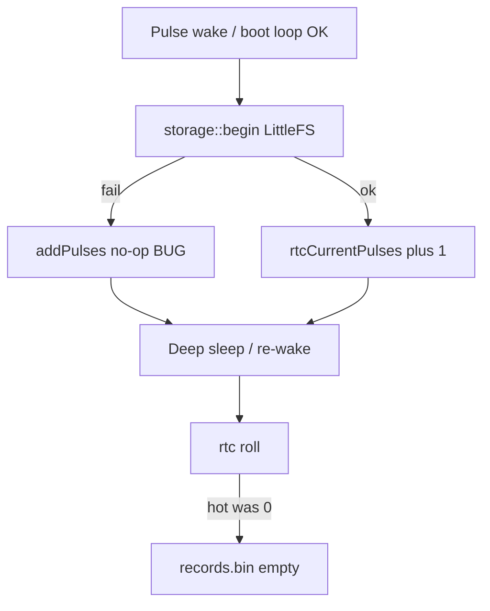

# Pulse counts missing after wake loop — revised plan

## Out of scope (by design)

**Stuck-low GPIO re-wake / boot loop is OK** — not a bug. Do **not** change `enterDeepSleep` settle timing, wait-forever-for-HIGH, or pulse-wake arming policy for that reason.

## What the dump proves

After the wake loop, long-press stay-awake, then `d` / RTC rolls:

- `readings: []` / `no_data`
- `/records.bin (0 bytes)` after **two** `rtc roll` lines

`rollCurrentPeriod` only appends when `rtcCurrentPulses > 0`. Empty file after roll means the **open hot counter was 0**. Counts from that loop never landed in `rtcCurrentPulses` (or were wiped before roll).

## Root cause

### Hot pulse increment gated on LittleFS

```241:251:src/storage.cpp
bool addPulses(uint32_t timestamp, uint32_t count) {
  if (!initialized) {
    return false;
  }
  // ... updates rtcCurrentPulses ...
}
```

`initialized` is set only after `LittleFS.begin(true)` succeeds. Pulse wake calls `storage::begin()`, but under rapid remounts mount can fail; then `addPulses` **no-ops**. Pulse path has no Serial, so failures are silent.

That coupling contradicts RTC-hot intent (count must work even when flash is unhappy). Spec already notes the skip ([fw_specification.md](docs/firmware/fw_specification.md)).

### Visibility traps (make failure hard to see)

These do **not** cause empty rolls; they hide whether hot ever moved:

1. Long press does not roll; `d` is LittleFS-only (open hot invisible).
2. `status` prints `awakePulseCount`, not `rtcCurrentPulses`.
3. `rtc roll` log does not print the hot count when skipping an empty append — looks like a successful roll with no explanation for empty `h`.
4. No single place shows `storage_ok` + hot + unsynced together after entering diagnostics.



---

## Solutions (implement)

### 1 — Decouple RTC hot from LittleFS (required)

`addPulses` / `incrementCurrentPulse` always update `rtcCurrentPulses` / `rtcCurrentPeriodStart` in RTC RAM. Do **not** require `initialized`. Keep LittleFS required for `rollCurrentPeriod`, `loadUploadBatch`, sync, stay-awake file, etc.

**Touch:** [`src/storage.cpp`](src/storage.cpp).

### 2 — Observability (required — first-class, not optional)

Goal: after a wake loop + long-press into diagnostics, one `s` (and a clearer `d` / roll log) must answer: *Did hot accumulate? Is FS up? Is dump empty only because nothing was rolled yet?*

#### Storage API

Add to [`include/storage.h`](include/storage.h) / [`src/storage.cpp`](src/storage.cpp):

- `uint16_t currentPulses()` — open hot count (`rtcCurrentPulses`)
- `uint32_t currentPeriodStart()` — open period start unix
- `bool available()` — LittleFS `initialized` (roll/load possible)
- Keep using existing `unsyncedCount()` where useful

#### `status` (`s`) — [`src/main.cpp`](src/main.cpp)

Extend the status block beyond `awakePulseCount` GPIO lines, e.g.:

```text
storage_ok=1 unsynced=0 hot_pulses=12 hot_start=1785440846 awake_count=0
```

Keep existing battery / wifi / pin / time lines. `hot_*` must come from RTC getters, not ISR RAM.

#### `dump` (`d`)

Before printing upload JSON:

- One line: open hot summary (`hot_pulses`, `hot_start`, `storage_ok`)
- One short clarification: JSON `readings` are **rolled LittleFS only**; open hot is not included until RTC roll or upload

So an empty `readings:[]` with `hot_pulses=12` is immediately distinguishable from “counts never happened.”

#### RTC roll serial

In [`handleRtcWake`](src/main.cpp) (and any similar roll path), always log hot before the roll decision, including the empty case:

```text
rtc roll hot_pulses=0 ... (no append)
rtc roll hot_pulses=12 -> appended ... records
```

Today’s `rtc roll battery=...` with a silent no-op append is what made empty `h` look mysterious.

#### SoT

Document diagnostics fields / dump caveat in [docs/firmware/fw_specification.md](docs/firmware/fw_specification.md) US diagnostics table.

### Not doing

- Wait-for-pulse-release / disarm pulse wake on stuck LOW
- Write LittleFS every pulse (breaks Q-7 write endurance)
- Deduplicate stuck-level wakes (boot loop accepted)
- Changing `d` to invent fake rolled readings from hot (summary line only; roll/upload remain the commit path)

## Verify

1. Hold pulse LOW through a wake loop → stay-awake → `s` shows `hot_pulses` &gt; 0 (after decouple) or `hot_pulses=0` + prior `storage_ok` history explains the old bug.
2. `d` with hot &gt; 0 and empty `readings` shows the open-hot line so it is not mistaken for total data loss.
3. RTC roll with hot=0 prints explicit no-append; with hot&gt;0, `h` shows non-empty `/records.bin`.
4. Normal short S0 pulse still +1.
5. SoT subagent updates fw_specification (hot vs FS + observability).
