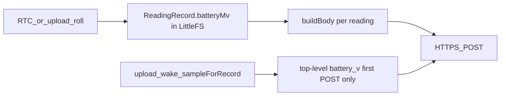

# Upload stored per-period battery samples

Skip the earlier sampling-frequency work (nth RTC roll / Alarm 2). Firmware already writes `batteryMv` into each closed [`ReadingRecord`](include/storage.h). The only gap is [`upload::buildBody`](src/upload.cpp), which currently serializes readings as `timestamp` / `period_start` / `pulses` only.

The backend already accepts optional per-reading `battery_v` / `battery_pct_est` ([`MeterReading`](backend/app/schemas/upload.py)), persists them on `meter_readings`, and the HTML index already charts `r.battery_v` when present.

## Firmware

In [`src/upload.cpp`](src/upload.cpp) `buildBody`, for each `record` add:

- `battery_v`: `record.batteryMv / 1000.0f` with the same 3 decimal places as the top-level field (`String(..., 3)`)
- `battery_pct_est`: `battery::estimatePercent(volts)` from that same voltage (percent is not stored on disk; the OCV table in [`src/battery.cpp`](src/battery.cpp) is the existing mapping)

Always emit both keys on every reading in the batch. Records only exist after a roll that had pulses, and that path always passed a real ADC mV.

Bump `body.reserve(...)` slightly (about +40 bytes per reading) so 48-record batches do not reallocate.

Do **not** change:

- When ADC runs (`handleRtcWake` / `handleUploadWake`)
- Top-level live `battery_v` / `battery_pct_est` (first POST of an upload session, or diagnostics `dump` preview)
- Record layout, CRC, or LittleFS format

Diagnostics `d` / `dump` already calls `buildBody` with loaded records, so the preview JSON will pick up per-reading battery with no extra `main.cpp` work.

## Backend / tests

No schema or DB migration. Optional but useful: extend [`backend/tests/test_app.py`](backend/tests/test_app.py) so a payload **with** per-reading battery is round-tripped into `meter_readings` / dump JSON (today one test only asserts that omitted keys stay omitted, which remains valid).

## Docs

After the code change, spawn the spec subagent per workspace rule:

- [`docs/api/upload.md`](docs/api/upload.md) — example reading objects include `battery_v` / `battery_pct_est`; reading-field table and “Firmware body builder” stop saying firmware does not emit them
- [`docs/firmware/fw_specification.md`](docs/firmware/fw_specification.md) — US-4 / upload JSON: `batteryMv` is now on the wire per reading; top-level live sample unchanged

`intent_spec` M-3 already requires battery condition on the period record; no intent change required unless we want a one-line note that the upload carries that stored condition.
