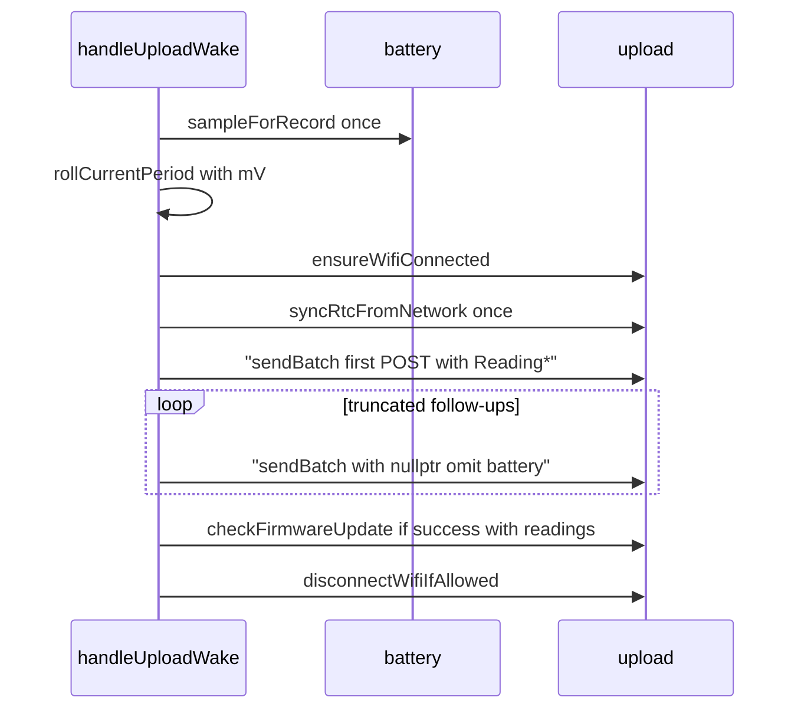

# Faster multi-batch upload (Wi‑Fi + NTP session)

## Goal

Today each `sendBatch` call in [`src/upload.cpp`](src/upload.cpp) connects (if needed), **always NTP-syncs**, POSTs, then **powers Wi‑Fi off** (unless `KeepWifiConnectedWhenAwake`). Truncated uploads (`MaxUploadRecords` = 48) therefore pay full connect + NTP again per chunk.

Change to a **session** model owned by [`handleUploadWake`](src/main.cpp):

## Preserve: battery on first batch only

Do **not** change the existing battery contract:

- One `battery::sampleForRecord()` before the loop (Wi‑Fi forced off + settle) for `rollCurrentPeriod` mV **and** the live top-level JSON fields.
- `includeBattery` starts `true`: first `sendBatch(..., &reading)` so `buildBody` emits `battery_v` / `battery_pct_est`.
- Then set `includeBattery = false`: follow-up truncated POSTs pass `nullptr` and omit those keys.
- Keep sampling **before** Wi‑Fi connect so ADC is not polluted by radio (current order: sample → roll → connect → NTP → POSTs).

## Concrete approach

### 1. `sendBatch` becomes POST-only (radio/time owned by caller)

In [`src/upload.cpp`](src/upload.cpp) / [`include/upload.h`](include/upload.h):

- Keep `ensureWifiConnected()` inside `sendBatch` as a safety reconnect if the link drops mid-session (no-op when already connected).
- **Remove** `syncRtcFromNetwork()` from `sendBatch`.
- **Remove** all `disconnectWifiIfAllowed()` calls from `sendBatch` success and failure paths (session teardown moves to the caller).
- Export a public teardown helper (promote today’s private `disconnectWifiIfAllowed`, same semantics: no-op when `KeepWifiConnectedWhenAwake`).
- Leave `buildBody` / `sendBatch(..., const battery::Reading*)` signature unchanged (`nullptr` = omit top-level battery).

NTP failure remains best-effort (same as today: upload still proceeds if NTP fails).

### 2. `handleUploadWake` owns the session

In [`src/main.cpp`](src/main.cpp) `handleUploadWake`:

1. Keep existing pre-loop work: flush → `sampleForRecord` → `rollCurrentPeriod`.
2. Before the batch loop: `ensureWifiConnected()`; on failure → mark upload failed, skip POSTs, error blink as today.
3. On connected: call `syncRtcFromNetwork()` **once**.
4. Existing `while` loop unchanged for battery: `loadUploadBatch` → `sendBatch(batch, includeBattery ? &reading : nullptr)` → clear `includeBattery` → mark synced / continue on `truncated`.
5. After the loop (and after optional `checkFirmwareUpdate` on success-with-readings): always `disconnectWifiIfAllowed()` so deep-sleep paths still power the radio down.

Side effect (intentional): OTA check in US-10 can actually run with Wi‑Fi still up, instead of no-oping after per-batch disconnect. Spec text already notes the old no-op behavior — update it.

Stay-awake entry ([`enterStayAwakeMode`](src/main.cpp)) already does connect + NTP outside `sendBatch`; leave that path unchanged.

### 3. Normative docs (spawn SoT subagent after code)

Per workspace rule, after the code change spawn a docs subagent to update:

- [`docs/firmware/fw_specification.md`](docs/firmware/fw_specification.md) — US-4 / upload sequence / US-10: Wi‑Fi + NTP once per wake; disconnect after session (and after OTA attempt); not per `sendBatch`.
- [`docs/intent_spec.md`](docs/intent_spec.md) only if a requirements-level latency/power bullet needs a one-line tweak; no API JSON change → leave [`docs/api/upload.md`](docs/api/upload.md) alone.

## Files

| File | Change |
| --- | --- |
| [`include/upload.h`](include/upload.h) | Declare `disconnectWifiIfAllowed()` (or equivalent name) |
| [`src/upload.cpp`](src/upload.cpp) | Remove NTP + disconnect from `sendBatch`; export disconnect |
| [`src/main.cpp`](src/main.cpp) | Session connect → NTP once → loop → OTA → disconnect |
| `docs/firmware/fw_specification.md` | Via docs subagent |

## Verify

- Single-batch short press: still sample → connect → one NTP → one POST **with** `battery_v` / `battery_pct_est` → disconnect (then sleep).
- Truncated backlog (>48 unsynced): one `wifi connect` / one `ntp sync`; first POST includes battery keys; follow-up POSTs omit them; no reconnect between POSTs.
- Wi‑Fi failure before loop: no POST, error blink, radio left off / disconnected.
- `KeepWifiConnectedWhenAwake=true`: disconnect helper still no-ops; stay-awake NTP path unchanged.
