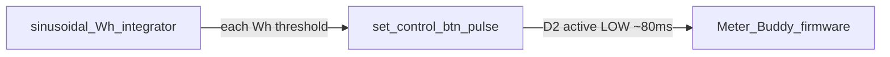

# Wokwi simulator + pulse mimicker on feature branch

## Default choice

Prioritize **interactive stay-awake sim** plus a **host-side pulse generator** patterned on [`hass_sim/sim.py`](hass_sim/sim.py):

- PlatformIO `[env:wokwi]` with `EnableDeepSleep = false` via committed [`include/config_wokwi.h`](include/config_wokwi.h)
- Hardware env and gitignored `local_config.h` unchanged
- New [`wokwi_sim/`](wokwi_sim/) script: same sinusoidal Wh integrator as HA sim; each threshold crossing **presses/releases** the Wokwi pulse pushbutton (`btn_pulse` on D2) instead of Home Assistant `button.press`

Deep-sleep GPIO wake fidelity remains out of scope for v1.

## Branch

```text
git checkout -b feat/wokwi-sim
```

## 1. PlatformIO env

Extend [`platformio.ini`](platformio.ini):

```ini
[env:wokwi]
extends = env:seeed_xiao_esp32c3
build_flags =
  ${env:seeed_xiao_esp32c3.build_flags}
  -DMB_WOKWI=1
```

## 2. Config selection

Update [`include/config.h`](include/config.h) so `MB_WOKWI` selects a committed sim config (never `local_config.h`):

```cpp
#ifdef MB_WOKWI
#include "config_wokwi.h"
#elif __has_include("local_config.h")
#include "local_config.h"
#else
#include "config.example.h"
#endif
```

[`include/config_wokwi.h`](include/config_wokwi.h) knobs:

| Knob | Value | Why |
| --- | --- | --- |
| `WifiSsid` | `"Wokwi-GUEST"` | Built-in open AP |
| `WifiPassword` | `""` | Open network |
| `EnableDeepSleep` | `false` | Stay awake so pulse ISR / diagnostics run |
| `KeepWifiConnectedWhenAwake` | `true` | Less reconnect churn |
| `AllowInsecureTls` | `true` | Easier local/backend TLS |
| `UploadUrl` / auth | Placeholders | Edit for real upload tests |
| `DeviceId` | `"meter-buddy-wokwi"` | Distinguish sim traffic |
| `MeterImpulsesPerKwh` | `1000` | Match `wokwi_sim` `PULSE_CONSTANT` |

## 3. Wokwi project files

### [`wokwi.toml`](wokwi.toml)

```toml
[wokwi]
version = 1
firmware = '.pio/build/wokwi/firmware.bin'
elf = '.pio/build/wokwi/firmware.elf'
```

### [`diagram.json`](diagram.json)

Board: `board-xiao-esp32-c3`. Pins match [`include/pins.h`](include/pins.h).

| Part id | Role | Wiring |
| --- | --- | --- |
| `btn_upload` | Upload / long-press | D1 ↔ GND |
| `btn_pulse` | S0 / TEMT6000 stand-in (**driven by sim.py**) | D2 ↔ GND; `bounce: "0"` so scripted presses are clean |
| `btn_rtc` | Manual RTC INT | D3 ↔ GND |
| Pulse LED + 330Ω | D8 → GND |
| Status LED + 330Ω | D10 → GND |
| Pot | Battery sense on A0 |

No DS3231 in v1 (fallback timestamps OK). Part id `btn_pulse` is the contract for the Python sim.

## 4. Pulse mimicker — `wokwi_sim/` (like `hass_sim/`)

Mirror layout of [`hass_sim/`](hass_sim/):

| File | Role |
| --- | --- |
| [`wokwi_sim/sim.py`](wokwi_sim/sim.py) | Async integrator + pulse injection |
| [`wokwi_sim/requirements.txt`](wokwi_sim/requirements.txt) | `wokwi-client`, `python-dotenv` |
| [`wokwi_sim/.env.example`](wokwi_sim/.env.example) | `WOKWI_CLI_TOKEN=...` (gitignored `.env`) |

### Physics (same as hass_sim)

Reuse the same knobs and algorithm from [`hass_sim/sim.py`](hass_sim/sim.py):

- `SAMPLE_INTERVAL_SEC = 0.1`
- Sinusoidal load: `BASE_LOAD_KW` + `AMPLITUDE_KW * sin(...)`
- Accumulate Wh; when ≥ `1000 / PULSE_CONSTANT`, fire one pulse
- Phase-locked `next_tick` sleep so the loop does not drift

### Injection (Wokwi instead of HA)

Replace `press_esphome_button` with a short active-LOW pulse on the diagram button:

```python
# part-id must match diagram.json
await client.set_control(part="btn_pulse", control="pressed", value=1)
await asyncio.sleep(PULSE_WIDTH_SEC)  # ~0.08s (≥ PulseDebounceMs, within ~3–50ms S0 band → use ~40–80ms)
await client.set_control(part="btn_pulse", control="pressed", value=0)
```

Fire-and-forget via `asyncio.create_task(...)` like hass_sim, so the physics loop stays real-time.

### How the client owns the sim

`wokwi_sim/sim.py` **starts** the Wokwi simulation (same pattern as [wokwi-python-client](https://github.com/wokwi/wokwi-python-client) examples), rather than attaching to the VS Code extension tab:

1. Require `WOKWI_CLI_TOKEN` from `wokwi_sim/.env` (user already has a Wokwi license; CLI token from Wokwi dashboard)
2. `pio run -e wokwi` must have produced `.pio/build/wokwi/firmware.bin` (script prints a clear error if missing)
3. Upload `diagram.json` + firmware (+ elf if useful)
4. `start_simulation`
5. Optionally stream serial in a background task (`serial_monitor_cat`) so pulse/storage logs are visible
6. Run the integrator until Ctrl+C

This parallels hass_sim’s “script drives an already-running device,” except the Python client **is** the sim host (VS Code **Wokwi: Start Simulator** remains available for manual click-testing without the script).



## 5. Docs

Short README section:

1. Build: `pio run -e wokwi`
2. Manual: Command Palette → **Wokwi: Start Simulator** (click buttons)
3. Automated pulses:
   ```text
   cd wokwi_sim
   pip install -r requirements.txt
   copy .env.example .env   # set WOKWI_CLI_TOKEN
   python sim.py
   ```
4. Note: pulse script uses the API sim (not the VS Code tab); Wi‑Fi is `Wokwi-GUEST`; edit `config_wokwi.h` for upload URL

No SoT update — tooling only.

## 6. Verify

1. `pio run -e wokwi` succeeds
2. Manual Wokwi: status LED awake; click `btn_pulse` → pulse LED / serial
3. `python wokwi_sim/sim.py`: load/accumulator lines print; pulse count climbs; firmware serial shows pulse activity
4. `pio run -e seeed_xiao_esp32c3` still builds without `MB_WOKWI`

## Out of scope (later)

- Share one physics module between `hass_sim` and `wokwi_sim` (v1 duplicates intentionally, like two thin drivers)
- Attach pulse script to an already-open VS Code Wokwi tab
- DS3231 custom chip / deep-sleep wake loops
- HTTPS upload E2E against Docker
