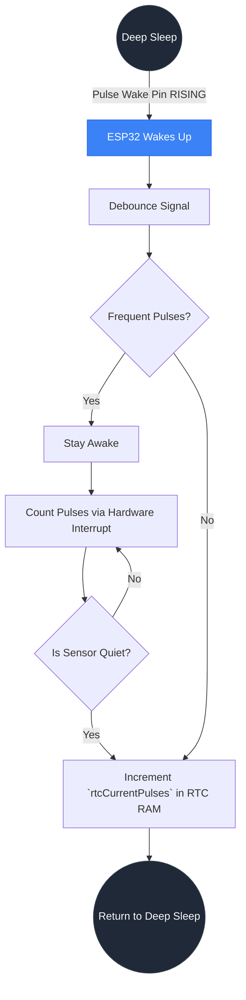
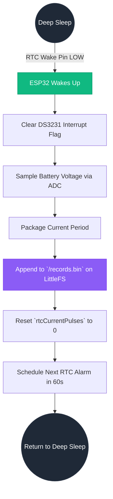
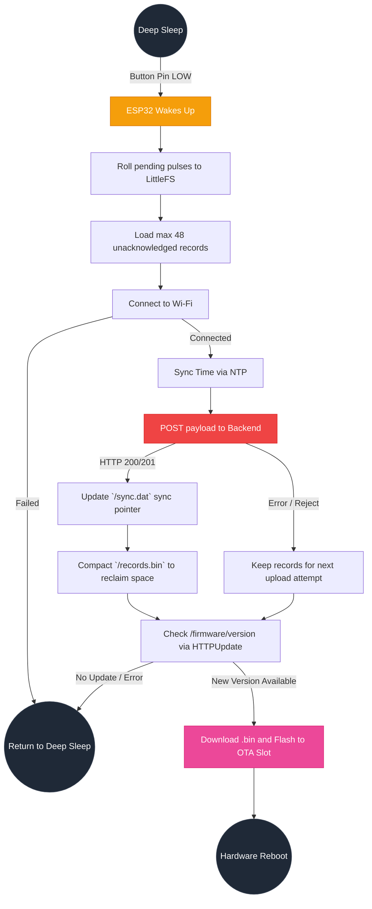
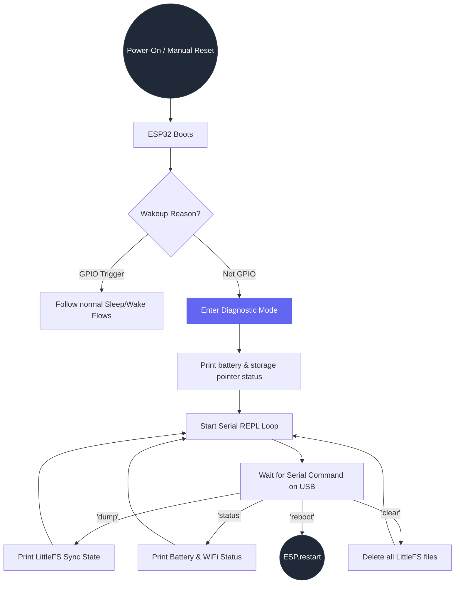

# Meter Buddy - Input Flows & Behavior

This document visually maps how the ESP32-C3 firmware responds to external hardware and software inputs. Since the device operates almost entirely in deep sleep to conserve battery, its behavior is strictly event-driven based on specific wakeup causes.

## 1. Pulse Sensor Flow (GPIO4)
When the TEMT6000 light sensor detects a flash from the utility meter, it sends a rising edge to GPIO4. To maximize flash memory life, this flow intentionally avoids writing to LittleFS, storing the state purely in RTC RAM (`RTC_DATA_ATTR`).

---

## 2. RTC Alarm Flow (GPIO5)
The DS3231 RTC triggers an alarm every 60 seconds. This acts as the device's "heartbeat" to commit the hot pulse counts into permanent cold storage (LittleFS).

---

## 3. Upload Button Flow (GPIO3)
A user short-press initiates the network upload cycle. This sequence orchestrates Wi-Fi connection, time synchronization, data payload POSTing, and checking for Over-The-Air (OTA) firmware updates.

---

## 4. Diagnostic Boot Flow (USB/Reset)
When the device is powered on, manually reset via the button, or wakes up from an undefined source (not a GPIO interrupt), it drops into a debugging shell instead of going to sleep.

