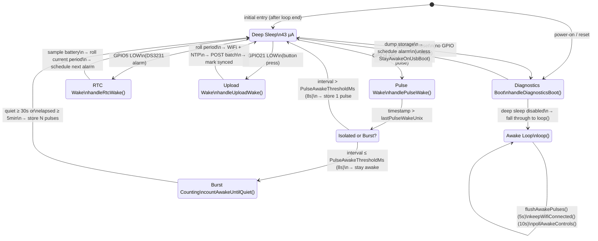
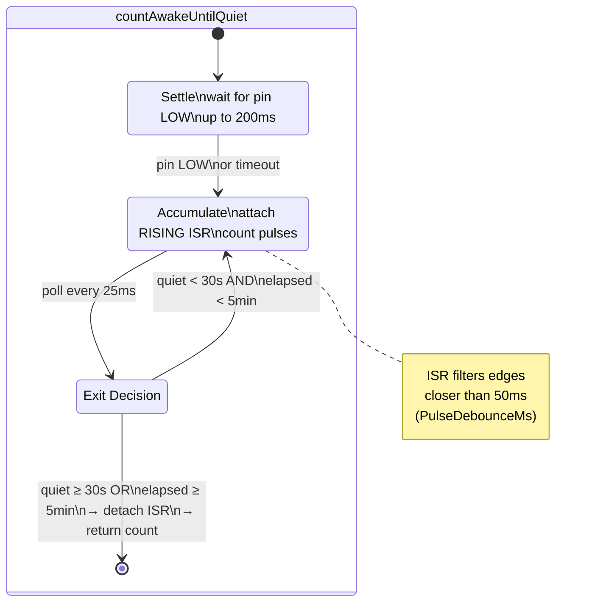
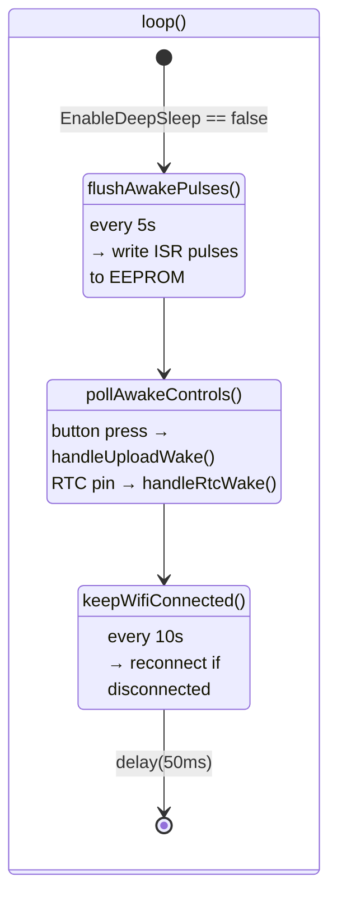

# Meter Buddy — C++ Firmware State (2026-06-18)

## Overview

Battery-powered ESP32-C3 firmware counting electricity meter LED pulses via a TEMT6000 light sensor. Pulses are accumulated in AT24C32 EEPROM as timestamped periods. Unsynchronized readings are uploaded via HTTPS POST to a remote server only when a physical button is pressed, keeping Wi-Fi off and deep sleep active the rest of the time.

**Board:** Seeed Studio XIAO ESP32-C3  
**Framework:** Arduino (ESP32 3.x) via PlatformIO  
**Key ICs:** DS3231 RTC, AT24C32 EEPROM (4 KB), TEMT6000 light sensor  
**Deep sleep current:** ~43 µA

---

## File Inventory

| File | Lines | Role |
|---|---|---|
| `src/main.cpp` | 370 | Entry point, wake dispatch, ISR, deep sleep orchestration |
| `src/battery.cpp` | 36 | ADC sampling (16× averaged), voltage-to-percent mapping |
| `src/rtc_clock.cpp` | 61 | DS3231 init, `nowUnix()`, `adjustUnix()`, alarm scheduling |
| `src/storage.cpp` | 233 | AT24C32 header management, record append/read, CRC-16 integrity |
| `src/upload.cpp` | 207 | Wi-Fi connect, NTP sync, HTTPS POST with JSON body |
| `include/pins.h` | 25 | GPIO constants for all hardware interfaces |
| `include/config.example.h` | 45 | Compile-time defaults (template for local config) |
| `include/config.h` | 10 | Conditional include: `local_config.h` or `config.example.h` |
| `include/battery.h` | 17 | `battery::Reading` struct, `begin()`, `sample()`, `estimatePercent()` |
| `include/rtc_clock.h` | 14 | `rtc_clock::begin()`, `nowUnix()`, `adjustUnix()`, alarm functions |
| `include/storage.h` | 35 | `ReadingRecord`, `UploadBatch`, EEPROM read/write API |
| `include/upload.h` | 21 | `upload::Result` enum, `sendBatch()`, `ensureWifiConnected()` |
| `include/local_config.h` | 44 | Active local overrides (gitignored) |

---

## State Machine



### Burst Counting Detail (`countAwakeUntilQuiet`)



### Awake Loop Detail (`loop()`)



---

## Key Data Types

### `storage::ReadingRecord` (packed, 22 bytes)
```
offset  size  field
  0      4    sequence       (monotonic ID, wraps in 2^32)
  4      4    periodStart    (unix timestamp)
  8      4    periodEnd      (unix timestamp)
 12      4    pulses         (pulse count in this period)
 16      2    batteryMv      (end-of-period mV / 1000)
 18      2    flags          (reserved)
 20      2    crc            (CRC-16 over preceding 20 bytes)
```
Fixed ring buffer: up to ~186 records in 4 KB EEPROM (63 + 1920 = 1984 usable bytes for records at 22 bytes/record → `(4096 - 64) / 22 = 183` slots).

### `storage::UploadBatch`
```
records[48]   — up to 48 reading records
count         — number of valid records in this batch
newestSequence — highest synced sequence number
```

### `upload::Result`
```cpp
enum class Result { Success, NoData, WifiFailed, HttpFailed, ServerRejected };
```

### `battery::Reading`
```cpp
struct Reading { float volts; uint8_t percent; };
```

---

## EEPROM Layout (AT24C32)

| Address | Content |
|---------|---------|
| 0 – 63 | `Header` (magic=0x4D425544, version=1, nextSequence, syncedThrough, currentPeriodStart, currentPulses, crc) |
| 64 – 4095 | Ring-buffer of `ReadingRecord` (22 bytes each, ~183 slots) |

Header fields:
- **magic** – `0x4D425544` (`"MBUD"`)
- **nextSequence** – next available sequence number
- **syncedThrough** – highest sequence confirmed uploaded
- **currentPeriodStart** – unix time when the open period started
- **currentPulses** – pulse count accumulating into the open period

---

## Timing Parameters (`config.example.h`)

| Constant | Default | Purpose |
|---|---|---|
| `PulseDebounceMs` | 50 ms | ISR edge filter |
| `PulseAwakeThresholdMs` | 8 000 ms | Gap threshold: isolated vs burst |
| `PulseAwakeQuietMs` | 30 000 ms | End-of-burst quiet timeout |
| `PulseAwakeMaxMs` | 300 000 ms | Hard cap on burst counting |
| `AwakePulseFlushMs` | 5 000 ms | Burst → EEPROM flush interval |
| `WifiReconnectIntervalMs` | 10 000 ms | WiFi reconnect check interval |
| `WifiConnectTimeoutMs` | 30 000 ms | Max Wi-Fi join wait |
| `HttpTimeoutMs` | 20 000 ms | HTTP POST timeout |
| `NtpSyncTimeoutMs` | 10 000 ms | NTP sync timeout |
| `RtcWakeIntervalMinutes` | 1440 (24h) | DS3231 alarm interval |
| `MeterImpulsesPerKwh` | 1000 | Meter constant (included in upload JSON) |

---

## Event Lifecycle

### Pulse arrives (GPIO4 rising edge)
1. Deep sleep → `setup()` → GPIO4 HIGH detected
2. `handlePulseWake()`: discard re-wake if same second
3. `sleepMakesSenseAfterPulse()`: compare gap to `PulseAwakeThresholdMs`
4. If burst: `countAwakeUntilQuiet()` → attach ISR, accumulate until quiet, detach
5. `storage::addPulses(timestamp, count)` writes to EEPROM header
6. `enterDeepSleep()`

### RTC alarm fires (GPIO5 LOW)
1. Deep sleep → `setup()` → GPIO5 LOW detected
2. `handleRtcWake()`: clear alarm, sample battery, roll current period (finalize + start new)
3. `scheduleNextWakeAlarm()`
4. `enterDeepSleep()`

### Upload button pressed (GPIO21 LOW)
1. Deep sleep → `setup()` → GPIO21 LOW detected
2. `handleUploadWake()`: debounce, dump storage, roll period, load batch
3. `upload::sendBatch()`: WiFi connect, NTP sync → RTC adjust, build JSON, HTTPS POST
4. If HTTP 200/201: `storage::markSyncedThrough()`
5. `enterDeepSleep()`

### Cold boot / USB power
1. `setup()` → no GPIO wake → `handleDiagnosticsBoot()`: dump storage, sample battery
2. `scheduleNextWakeAlarm()`
3. If `StayAwakeOnUsbBoot`: attach pulse ISR, maybe WiFi → fall through to `loop()`
4. Otherwise: `enterDeepSleep()`

---

## Key Design Decisions

- **No formal state machine class.** Wake-cause dispatch in `setup()` plus `loop()` polling implements the state machine procedurally. State is not stored explicitly — the wake cause and GPIO pin levels determine the current path.
- **Re-wake gating via `lastPulseWakeUnix`.** The same persistent pulse edge can re-wake the ESP32 immediately; the timestamp check prevents double-counting.
- **Ring-buffer EEPROM without wear leveling.** A 4 KB AT24C32 with ~183 slots and a full cycle every ~186 uploads translates to ~1M+ writes before wear concern.
- **WiFi on demand only.** The radio is off in deep sleep and only turned on during explicit button-press upload sessions, minimizing battery drain.
- **NTP sync on every upload.** The DS3231 drifts between sessions (typically <2 min/year) so each upload session resyncs via NTP.
- **`local_config.h` for credentials.** All compile-time, gitignored local overrides; no runtime provisioning yet.
