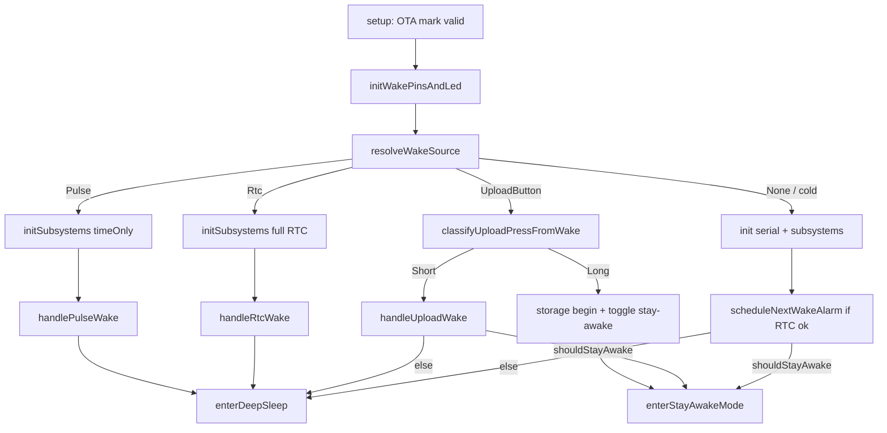
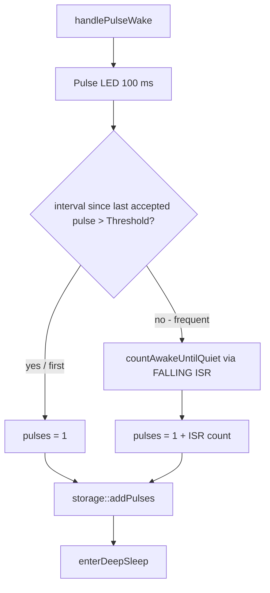
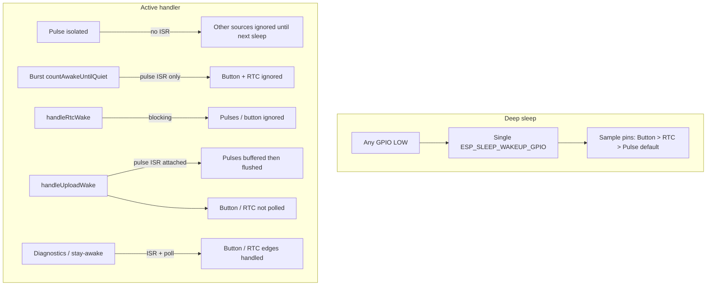

# Meter Buddy Firmware Specification

**Status:** normative for firmware behavior. Must match `src/main.cpp` and helpers.  
**Companion:** [../intent_spec.md](../intent_spec.md) — user requirements without implementation choices.  
**Hardware target:** Seeed XIAO ESP32-C3, battery-powered, deep-sleep dominant.

This document describes **what the firmware does today**, including architecture and concurrent-wake behavior.

---

## 1. User stories

### US-1 — Isolated meter pulse
**Given** the device is in deep sleep and storage initialized,  
**When** a short optical S0 pulse (~3–50 ms) asserts `PulseWakePin` LOW,  
**Then** the device wakes, flashes the pulse LED ~100 ms, increments the hot pulse counter by 1 (RTC RAM; skipped if LittleFS init failed), and calls `enterDeepSleep()` (deep sleep when enabled; see US-9 if disabled). No Wi‑Fi. No LittleFS period append on this path.

### US-2 — Frequent / burst pulses
**Given** another pulse wake occurs more than 0 s and within `PulseAwakeThresholdMs` (8 s) after the last *accepted* pulse wake timestamp,  
**When** that wake is handled,  
**Then** the device stays awake, attaches a pulse ISR, accumulates additional pulses until `PulseAwakeQuietMs` (30 s) of quiet, stores `1 + ISR count`, then deep-sleeps (if deep sleep is enabled).

**Same-second caveat:** Timestamps are unix seconds (`rtc_clock` or `millis()/1000`). If `timestamp <= lastAcceptedPulseWakeUnix` (including two wakes in the same second), `sleepMakesSenseAfterPulse` treats the wake as isolated: credit 1 and sleep — burst mode does **not** run. Rapid sub-second trains after an isolated wake therefore rely on later wakes being in a later second, or on an already-awake ISR path.

### US-3 — RTC period roll (housekeeping)
**Given** deep sleep (or an awake diagnostics session),  
**When** the DS3231 alarm asserts `RtcWakePin` LOW and the RTC path runs,  
**Then** firmware clears/reschedules the alarm, samples battery voltage, appends a completed period record to LittleFS if the hot pulse count is &gt; 0, resets hot counters, and blinks the status LED once. From a deep-sleep RTC wake, it then calls `enterDeepSleep()`. From diagnostics, the REPL continues without sleeping.

### US-4 — Short upload button press
**Given** sleep or an awake session,  
**When** the upload button is pressed and released before `UploadLongPressMs` (4 s),  
**Then** the status LED goes full brightness, the current period is rolled, Wi‑Fi connects, NTP syncs the RTC, JSON POST(s) run (including an empty heartbeat when there are no readings), the sync cursor advances only for batches that contained readings and received HTTP 200/201; on network/HTTP failure the status LED does `rapidErrorBlink`; then the device sleeps unless stay-awake is active.

### US-5 — Long press toggles stay-awake
**Given** the upload button is held ≥ 4 s,  
**When** the press is classified as long,  
**Then** `/stay_awake.dat` is toggled; **enable** → full LED + `doubleBlink`; **disable** → `rapidErrorBlink`; **no upload** runs. The session remains awake after the toggle (diagnostics mode).

### US-6 — Stay-awake / diagnostics
**Given** the flash stay-awake flag is set **or** a USB CDC host is open (`Serial.isPlugged() && Serial.isConnected()`),  
**When** cold boot completes, a long-press stay-awake path runs, or a short upload finishes while stay-awake applies,  
**Then** the device stays awake with dim PWM status LED, pulse ISR attached, and a serial REPL (`dump`/`d…`, `clear`/`c…`, `status`/`s…`, `t`/`time`, `upload`/`u…`, `reboot`/`r…`, `x`). Command `x` clears the stay-awake flag and calls `enterDeepSleep()`. Typing `sleep` is **not** sleep — first letter `s` runs `status`.

**Scope note:** Pulse and RTC deep-sleep wake paths always call `enterDeepSleep()` and do **not** consult `shouldStayAwake()`. With `EnableDeepSleep=true` that means sleep; with deep sleep disabled those calls return and `setup` ends into Arduino `loop()` (no diagnostics REPL, no pulse ISR unless attached elsewhere). USB stay-awake is therefore only effective on cold boot, upload-finish, and long-press paths (plus stay-awake mode once entered).

Command `x` clears the stay-awake flag and calls `enterDeepSleep()` (no-op sleep when deep sleep is disabled; REPL continues).

If `KeepWifiConnectedWhenAwake` is true, entering stay-awake also connects Wi‑Fi and NTP-syncs the RTC before the REPL. Long-press entry uses `beginTimeOnly()` and does not itself schedule/clear the RTC alarm; a still-asserted RTC pin may fire `handleRtcWake` on the first diagnostics poll.

### US-7 — Production cold boot
**Given** power-on / reset with no GPIO wake cause, stay-awake not required, and `EnableDeepSleep=true`,  
**When** boot completes,  
**Then** the next RTC alarm is scheduled (if RTC is available) and the device enters deep sleep immediately (no REPL). If deep sleep is disabled, see US-9.

### US-8 — LED meanings
| LED | Pin | Meaning |
| --- | --- | --- |
| Pulse LED | D8 | HIGH ~100 ms per accepted pulse (wake flash or ISR) |
| Status (`AwakeLed`) | D10 | Dim PWM (~30%, duty 77) = idle awake; full = upload in progress / long-press feedback; `blink` = RTC wake; `doubleBlink` = stay-awake enabled; `rapidErrorBlink` (10×) = upload failure **or** stay-awake disabled; off + pulldown = sleep |

### US-9 — Deep sleep disabled
**Given** `EnableDeepSleep=false`,  
**When** the device would otherwise sleep,  
**Then** `enterDeepSleep()` returns without sleeping. If stay-awake mode was entered, the pulse ISR is attached and the diagnostics REPL runs. If the device only falls through to Arduino `loop()` without having attached the ISR, `loop()` still flushes (if any), polls button/RTC, and optionally keeps Wi‑Fi alive — but pulses are **not** counted via ISR until stay-awake (or another attach path) has run.

### US-10 — OTA check after successful data upload
**Given** an upload succeeded and at least one reading was marked synced,  
**When** post-upload housekeeping runs,  
**Then** `upload::checkFirmwareUpdate()` is invoked. (Wi‑Fi is typically powered off after `sendBatch` unless `KeepWifiConnectedWhenAwake`, so the check may no-op if disconnected.)

---

## 2. Architecture

```text
┌─────────────────────────────────────────────────────────────┐
│                        src/main.cpp                         │
│  boot · wake resolve · handlers · ISR · sleep · diagnostics │
└───────────┬─────────────┬─────────────┬─────────────┬───────┘
            │             │             │             │
     ┌──────▼──────┐ ┌────▼────┐ ┌──────▼──────┐ ┌───▼────┐
     │  storage    │ │ upload  │ │ rtc_clock   │ │battery │
     │ LittleFS +  │ │ WiFi /  │ │ DS3231      │ │ ADC    │
     │ RTC hot     │ │ HTTPS / │ │ Alarm1      │ │        │
     │ counters    │ │ NTP/OTA │ │             │ │        │
     └─────────────┘ └─────────┘ └─────────────┘ └────────┘
            ▲
     pins.h · config.h · awake_led.h (header-only PWM)
```

### Module responsibilities

| Module | Role |
| --- | --- |
| `main.cpp` | Wake dispatch, pulse ISR, button classify, sleep arming, diagnostics REPL |
| `storage` | Hot counters in `RTC_DATA_ATTR`; LittleFS `/records.bin`, `/sync.dat`, `/stay_awake.dat` |
| `upload` | Wi‑Fi, NTP→RTC, HTTPS POST batches (with `errors[]`), OTA version check |
| `rtc_clock` | DS3231 time + Alarm1 schedule / clear |
| `battery` | Voltage divider sample on A0 |
| `awake_led` | Status LED PWM and blink patterns |
| `pins.h` / `config.h` | Pin map and compile-time knobs |

### Storage model (two tiers)

1. **Hot (RTC RAM):** `rtcCurrentPeriodStart`, `rtcCurrentPulses` — survive deep sleep, lost on power cut. Pulse counts saturate at 65535. Pulse wakes update these counters **without** a LittleFS write (write-endurance: avoids flash wear on every pulse). **Note:** `storage::addPulses` is gated on successful `storage::begin()`; if LittleFS init fails, hot counters are not updated for that boot.
2. **Burst timestamps (RTC RAM):** `lastAcceptedPulseWakeUnix` drives the frequent-pulse decision. `lastPulseWakeUnix` is written on each pulse wake but currently unused for decisions.
3. **Cold (LittleFS):** append-only period records; sync cursor; stay-awake flag. After a successful sync of readings, `compactRecords()` rewrites `/records.bin` to drop acknowledged sequences (see §6).

### Config knobs (defaults from `config.example.h`)

| Knob | Default | Purpose |
| --- | --- | --- |
| `PulseAwakeThresholdMs` | 8000 | Interval that triggers awake burst counting |
| `PulseAwakeQuietMs` | 30000 | Quiet time before sleep after burst mode |
| `PulseDebounceMs` | 50 | Pulse debounce / button release settle |
| `AwakePulseFlushMs` | 5000 | Periodic flush of ISR counts while awake |
| `WifiReconnectIntervalMs` | 10000 | Reconnect poll when keeping Wi‑Fi awake |
| `UploadLongPressMs` | 4000 | Short vs long press threshold |
| `RtcWakeIntervalSeconds` | 60 | DS3231 alarm period |
| `EnableDeepSleep` | true | Production sleep vs always-awake |
| `KeepWifiConnectedWhenAwake` | false | Keep Wi‑Fi after POST / on stay-awake entry |
| `StayAwakeBoot` | false | Compile-time default for stay-awake cache before/without flash file |
| `EnableSerialLogs` | true | Serial logging |

### Hardware assumptions

Firmware depends on the following pin map and power topology (Seeed XIAO ESP32-C3). Wake edges are **GPIO level LOW** in deep sleep and **FALLING** for the awake pulse ISR — not RISING/`ext0`.

| Function | Pin | Notes |
| --- | --- | --- |
| Battery ADC | A0 / D0 (GPIO2) | External 1:2 divider; FW scales `analogReadMilliVolts × 2` |
| Upload button | D1 (GPIO3) | To GND; `INPUT_PULLUP` — no external pull-up required |
| Pulse (TEMT6000 OUT) | D2 (GPIO4) | Active LOW into pull-up; deep-sleep wake capable |
| RTC alarm (DS3231 SQW) | D3 (GPIO5) | Active LOW |
| I2C SDA | D4 (GPIO6) | DS3231 |
| I2C SCL | D5 (GPIO7) | DS3231 |
| Pulse LED | D8 | Drive via series resistor on anode |
| Status LED | D10 | Drive via series resistor on anode |

**Power / sensors (firmware prerequisites):**

- XIAO **3.3V** powers **DS3231** and **TEMT6000**; all module GNDs common with XIAO GND.
- **TEMT6000 must be always-on 3.3V** (not GPIO-switched); otherwise it cannot assert D2 during deep sleep.
- Battery path: **LiPo → TP4056 → XIAO BAT+/GND**. Typical divider: **200 kΩ + 200 kΩ** (1%, 220 kΩ acceptable) from BAT+ to A0 midpoint to GND (matches FW 1:2 scale).
- **A0/GPIO2 is a strapping pin** — must not be held LOW at boot; the high-impedance divider keeps the pin near mid-rail (~1.85 V on a typical cell).
- DS3231 breakouts often include **AT24C32 EEPROM**; firmware **does not use it** (LittleFS on internal flash only).
- Optional **4.7 kΩ** I2C pull-ups if the breakout lacks them.
- TP4056: replace RPROG 1.2 kΩ with **~3 kΩ** (~400 mA charge) when using that charger module.
- Build prep: desolder DS3231 module power LED (idle drain); opaque shield/tape on TEMT6000 against ambient light; keep upload button accessible; verify divider with a multimeter before connecting the battery.

---

## 3. Wake and interrupt sources

There is **no** ESP32 timer deep-sleep wake. Periodicity comes from the external DS3231 Alarm1 → `RtcWakePin` LOW.

Deep sleep arms **GPIO level wake (LOW)** on three pins (ESP32-C3 wake-capable GPIOs 0–5):

| Source | Pin | Sleep arm | Identification after wake | Handler |
| --- | --- | --- | --- | --- |
| Upload button | D1 / GPIO3 | `GPIO_LOW` | Pin still LOW (priority 1) | Short → upload; long → stay-awake toggle |
| RTC alarm | D3 / GPIO5 | `GPIO_LOW` | Pin still LOW if button not LOW | `handleRtcWake` |
| S0 pulse | D2 / GPIO4 | `GPIO_LOW` | Often already HIGH; **default** if GPIO wake | `handlePulseWake` (always credit 1) |
| Cold / other | — | — | Cause ≠ `ESP_SLEEP_WAKEUP_GPIO` | Stay or sleep via `shouldStayAwake()` |

### Resolve policy

```text
if cause != GPIO wake → None
else if UploadButton == LOW → UploadButton
else if RtcWake == LOW → Rtc
else → Pulse   // S0 edges are short; pin often already HIGH
```

### Awake-only inputs (not deep-sleep wake)

| Input | Mechanism | Notes |
| --- | --- | --- |
| Pulse | `attachInterrupt(..., FALLING)` | Only while awake / burst / upload / diagnostics |
| Button | Polled edge in diagnostics / `pollAwakeControls` | Not a GPIO ISR |
| RTC pin | Polled edge while awake | Alarm cleared inside `handleRtcWake` |

### Pre-sleep settling (`enterDeepSleep`)

1. Pulse / status LEDs off; Wi‑Fi off.
2. Wait until pulse pin is HIGH (up to `PulseDebounceMs * 4`) so level wake does not double-count.
3. Wait for upload button release with debounce (avoids re-wake loops).
4. Arm all three GPIO LOW wakes; `esp_deep_sleep_start()`.

---

## 4. Flow diagrams

### 4.1 Boot / wake dispatch



### 4.2 Pulse wake (isolated vs burst)



### 4.3 Concurrent sources while a handler is running



---

## 5. Multiple interrupts during an active handler

Deep-sleep wakes are **single-shot**, not nested. Concurrent GPIO assertions collapse into one wake cause plus **priority sampling** at boot. There is no deferred work queue beyond pulse ISR counters / LED-off deadlines / poll edge latches.

### 5.1 Matrix

| Active path | Pulse arrives | Button arrives | RTC asserts | Behavior |
| --- | --- | --- | --- | --- |
| Isolated `handlePulseWake` | Credited as the wake (+1); no ISR | Ignored | Ignored | Immediate sleep after store |
| `countAwakeUntilQuiet` | Counted by FALLING ISR (debounced) | **Ignored** (blocking loop) | **Ignored** | Only `servicePulseLed` runs |
| `handleRtcWake` | No ISR — may miss | Ignored | Cleared via RTC begin | Then sleep |
| `handleUploadWake` | ISR attached; flushed at end | Not re-polled | Not polled | Mid-upload pulses enter the **new** hot period after pre-upload roll |
| Classify long/short from wake | No ISR yet | Occupied | Ignored | Early path before full init |
| Diagnostics / stay-awake | ISR on | Edge → upload or toggle | Edge → `handleRtcWake` | Serial REPL concurrent |
| `EnableDeepSleep=false` `loop()` | Via ISR if attached | `pollAwakeControls` | Same | Stay-awake attaches ISR |

### 5.2 Priority / misattribution rules (normative)

1. **GPIO wake + button still LOW** always wins over RTC and pulse, even if RTC also fired. The RTC alarm may remain asserted until a later RTC-handled path clears it.
2. **Default-to-Pulse:** a GPIO wake with button and RTC both HIGH is treated as a pulse (S0 edge usually gone). Spurious wakes with all pins HIGH are therefore counted as pulses.
3. **During burst counting or upload**, an RTC alarm may assert but is not handled until the next sleep/wake or a stay-awake poll — the period may run long; pulses still accumulate in the hot counter when an ISR is attached.
4. **Pulse during button/RTC wake** is not credited by `resolveWakeSource` and is missed unless an awake ISR is already attached on that path (upload attaches one; isolated RTC/pulse paths do not until burst mode).
5. **Burst decision** uses only `lastAcceptedPulseWakeUnix`. If the new timestamp is `<=` that value (same second or clock went backwards), the wake is treated as isolated — no burst counting.

### 5.3 Pulse ISR details (awake only)

- Edge: **FALLING** with `PulseDebounceMs` in the ISR.
- Shared `awakePulseCount` is read under `noInterrupts()` in flush/log paths.
- Pulse LED on is set in ISR; LED off is deferred to `servicePulseLed()` on the main path.

### 5.4 Re-wake mitigations

- Held button → `waitForUploadButtonRelease` before arming sleep.
- Pulse still LOW → settle wait before arming wakeup.
- Upload bounce → 50 ms debounce + stable HIGH window.
- Burst detection uses RTC unix timestamps in RTC memory across sleeps.

---

## 6. Upload behavior (detail)

1. Attach pulse ISR; status LED full. Forced upload from wake classify skips the extra 50 ms `uploadButtonPressed` debounce (already classified).
2. `rollCurrentPeriod` with battery mV.
3. Loop: `loadUploadBatch` → `upload::sendBatch` (connect Wi‑Fi, NTP sync each batch attempt, POST, then disconnect Wi‑Fi unless `KeepWifiConnectedWhenAwake`) → on Success with `count > 0` → `markSyncedThrough`; continue while `truncated`; stop on empty/non-truncated or failure.
4. `flushAwakePulses(true)`; detach ISR if this path attached it.
5. Success + had readings → optional OTA check via `upload::checkFirmwareUpdate()` (often no-ops because Wi‑Fi was just powered off); failure → `rapidErrorBlink`; restore dim awake LED. USB flashing remains a valid primary install path.

### Sync cursor and compaction

When `markSyncedThrough(newestSequence)` runs after HTTP 200/201 with readings:

1. Persist the advanced sync cursor in `/sync.dat`.
2. Call `compactRecords()`, which rewrites `/records.bin` keeping only records with `sequence > syncedThrough` (temp file → remove → rename).

Empty successful heartbeats (`batch.count == 0`) do **not** call `markSyncedThrough` and therefore do **not** compact. `repairSyncState()` on boot mismatch may also invoke `compactRecords()`.

### Batch / error payload

The device always attempts a POST (empty `readings` allowed). Storage may attach `errors[]` such as `no_data`, `crc_mismatch`, `storage_unavailable`, `batch_truncated`. Sync advances only on HTTP 200/201 for batches that contained readings. An empty successful heartbeat does **not** error-blink. Payload includes `"upload_trigger":"button"`.

---

## 7. Stay-awake gates

```text
shouldStayAwake =
  (serialStarted AND Serial plugged AND CDC connected)
  OR storage::stayAwakeBoot()
```

`storage::stayAwakeBoot()` reflects the LittleFS flag (seeded from compile-time `StayAwakeBoot` before/without a flash file). Long-press toggles the flash flag (in-RAM still updates even if LittleFS write fails).

---

## 8. Boot order (by design)

1. `esp_ota_mark_app_valid_cancel_rollback()` on every boot.
2. Pins + LED `setAwake()` first (user feedback + correct pin sample).
3. Resolve wake **before** Serial delay / heavy init.
4. Upload classify **before** LittleFS/I2C on the button wake path.
5. Pulse path is leanest: `initSubsystems(timeOnly)` only.

Timestamps use DS3231 when RTC init succeeded; otherwise `millis()/1000` fallback (affects burst intervals and period rolls).

Stay-awake enters `handleDiagnosticsBoot()` which never returns; Arduino `loop()` is unused in that mode. With deep sleep enabled and no stay-awake, `setup` sleeps and does not return.

**RTC while diagnostics:** `handleRtcWake` from the REPL rolls the period and reschedules the alarm but does **not** sleep — the REPL continues.

---

## 9. Consistency with code

This specification (with [intent_spec.md](../intent_spec.md)) is the firmware behavior contract. When changing `src/main.cpp` or helpers, update this file in the same change. Older notes archived under `docs/archive/` (`wiring.md`, `timing.md`, `input_flows.md`, etc.) are non-normative; drift is resolved in favor of **this document and the C++ sources**.
