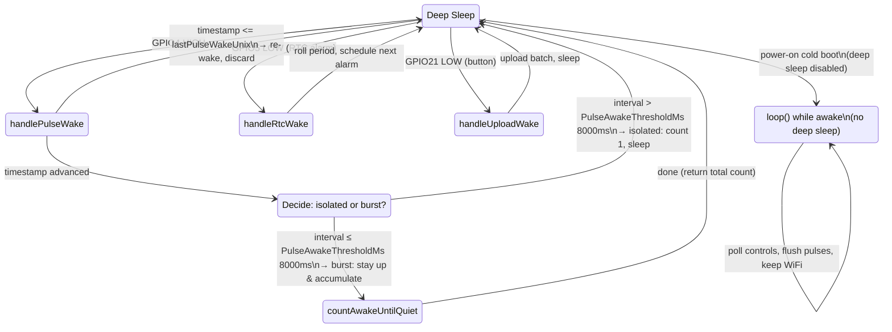
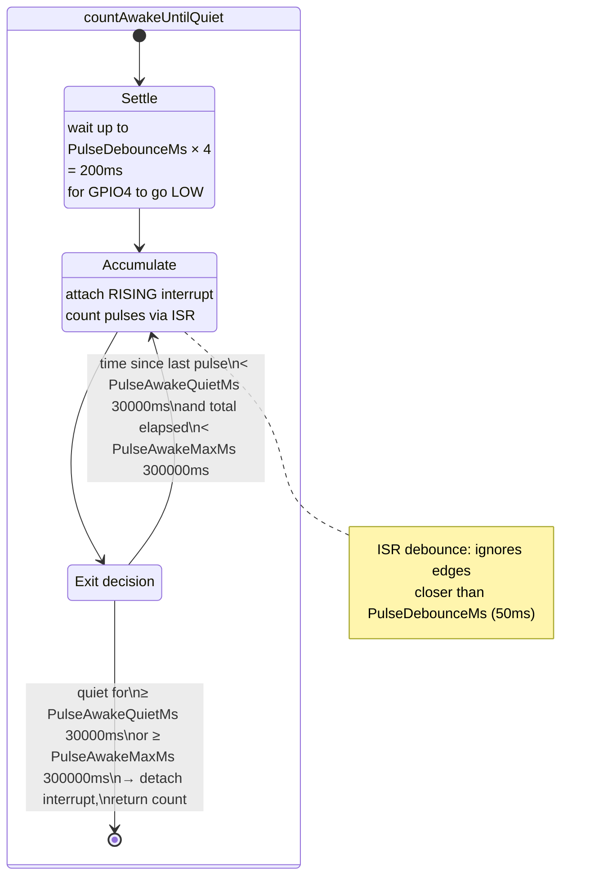
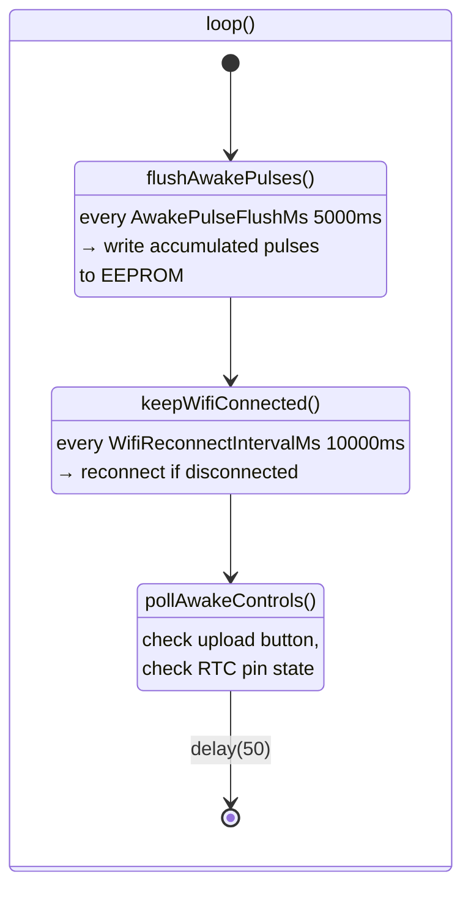

# Timing State Machine

## Timing Parameters

| Constant | Value | Role |
|---|---|---|
| `PulseDebounceMs` | 50 ms | Minimum interval between valid RISING edges (ISR filter) |
| `PulseDebounceMs × 4` | 200 ms | Settle timeout: wait for pin to go LOW before attaching interrupt or sleeping |
| `PulseAwakeThresholdMs` | 8 000 ms (8 s) | If gap since last pulse wake > this → isolated single pulse, sleep immediately; else → burst |
| `PulseAwakeQuietMs` | 30 000 ms (30 s) | No new pulses for this long → burst is over, exit awake counting |
| `PulseAwakeMaxMs` | 300 000 ms (5 min) | Hard cap on awake counting session |
| `AwakePulseFlushMs` | 5 000 ms (5 s) | Rate-limit for flushing burst pulses to EEPROM while staying awake |
| `WifiReconnectIntervalMs` | 10 000 ms (10 s) | Rate-limit for WiFi reconnect checks |
