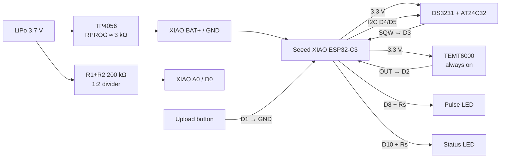

# Meter Buddy — Hardware schematic

**Status:** living hardware schematic. Pin map and power topology match [firmware/fw_specification.md](../firmware/fw_specification.md) (Hardware assumptions) and [include/pins.h](../../include/pins.h).  
**CAD import:** EasyEDA Pro netlist rebuild file — [meter_buddy.netlist.json](meter_buddy.netlist.json).

This is a **breakout / module** schematic (not a custom PCB SoC design): Seeed XIAO ESP32-C3 + DS3231/AT24C32 + TEMT6000 + TP4056 + LiPo.

---

## 1. Block diagram



---

## 2. Designators

| Ref | Part | Role |
| --- | --- | --- |
| U1 | Seeed Studio XIAO ESP32-C3 | MCU, Wi‑Fi, ADC, deep-sleep wake |
| U2 | DS3231 + AT24C32 I2C breakout | RTC alarm wake (SQW). EEPROM unused by firmware |
| U3 | TEMT6000 light-sensor breakout | Meter optical pulse → active-LOW wake on D2 |
| U4 | TP4056 LiPo charger module | USB charge into battery / XIAO BAT pads |
| BT1 | LiPo cell (e.g. 3.7 V) | Main power |
| SW1 | Momentary SPST | Upload / stay-awake button to GND |
| R1 | 200 kΩ 1% | Battery divider upper (BAT+ → A0) |
| R2 | 200 kΩ 1% | Battery divider lower (A0 → GND); 220 kΩ pair also OK |
| R3 | 330 Ω | Pulse LED series (anode side) |
| R4 | 330 Ω | Status LED series (anode side) |
| R5 | 4.7 kΩ | Optional I2C SDA pull-up to 3.3 V |
| R6 | 4.7 kΩ | Optional I2C SCL pull-up to 3.3 V |
| R7 | 3 kΩ | TP4056 RPROG substitute (~400 mA charge) |
| D1 | LED | Pulse indicator (D8) |
| D2 | LED | Status / awake indicator (D10) |

`R3`/`R4` values are not firmware-critical; pick for LED Vf / brightness at 3.3 V. `R5`/`R6` only if the DS3231 breakout lacks on-board pull-ups.

---

## 3. Pin map (normative)

| Net / function | U1 XIAO pin | GPIO | Connects to |
| --- | --- | --- | --- |
| `VBAT_SENSE` | D0 / A0 | GPIO2 | R1–R2 midpoint (strapping-safe mid-rail) |
| `BTN_UPLOAD` | D1 | GPIO3 | SW1 → `GND` (`INPUT_PULLUP`, active LOW) |
| `PULSE` | D2 | GPIO4 | U3 OUT (active LOW into pull-up) |
| `RTC_INT` | D3 | GPIO5 | U2 SQW/INT (active LOW) |
| `SDA` | D4 | GPIO6 | U2 SDA (+ optional R5) |
| `SCL` | D5 | GPIO7 | U2 SCL (+ optional R6) |
| `LED_PULSE` | D8 | GPIO8 | R3 → D1 anode; cathode → `GND` |
| `LED_STATUS` | D10 | GPIO10 | R4 → D2 anode; cathode → `GND` |
| `V3V3` | 3.3V | — | U2 VCC, U3 VCC, optional R5/R6 |
| `GND` | GND | — | Common ground |
| `VBAT` | BAT+ (underside) | — | BT1 +, U4 B+, R1 |

Wake edges: deep-sleep GPIO **LOW**; awake pulse ISR **FALLING** (see fw_specification).

---

## 4. Netlist (logical)

### Power

```
BT1+ ──┬── U4.B+ ── U1.BAT+ ── R1 ──┬── U1.A0 / D0   (net VBAT_SENSE)
       │                             │
BT1− ──┴── U4.B− ── U1.GND          R2
                                     │
                                    GND

U4.IN+ / IN− ← USB 5 V charge input (module pads)
U1.3V3 ── U2.VCC, U3.VCC
All module GNDs tied to U1.GND
```

### Signals

| Net | From | To |
| --- | --- | --- |
| `PULSE` | U3.OUT | U1.D2 |
| `RTC_INT` | U2.SQW | U1.D3 |
| `SDA` | U2.SDA | U1.D4 |
| `SCL` | U2.SCL | U1.D5 |
| `BTN_UPLOAD` | SW1 | U1.D1 ↔ GND |
| `LED_PULSE` | U1.D8 | R3 → D1 → GND |
| `LED_STATUS` | U1.D10 | R4 → D2 → GND |

---

## 5. Subcircuit notes

### Battery divider

- Ratio **1:2**; firmware multiplies ADC volts by 2.
- Prefer **200 kΩ + 200 kΩ** 1%; **220 kΩ + 220 kΩ** acceptable.
- **A0 / GPIO2 is a strapping pin** — must not be held LOW at boot. High-Z divider holds ~½ cell voltage (~1.85 V typical).

### TEMT6000

- **Always powered from 3.3 V** (never GPIO-switched) so pulses can wake deep sleep.
- Shield / tape against ambient light; point at meter LED.

### DS3231

- Firmware uses time + Alarm1 on SQW only; **AT24C32 is unused** (storage is LittleFS on internal flash).
- Desolder module power LED to cut idle drain.
- Add R5/R6 if the breakout has no I2C pull-ups.

### TP4056

- Replace stock RPROG (~1.2 kΩ) with **R7 ≈ 3 kΩ** (~400 mA).
- Battery path: **LiPo → TP4056 B± → XIAO BAT+/GND**.

### LEDs

- Anode driven from GPIO through series resistor; cathode to GND (active HIGH).

---

## 6. Build checklist

- [ ] DS3231 power LED removed
- [ ] TP4056 RPROG → ~3 kΩ
- [ ] Divider soldered BAT+ → R1 → A0 → R2 → GND; verified mid-point with meter before full assembly
- [ ] TEMT6000 on 3.3 V continuous; optical shield fitted
- [ ] Upload button accessible; D1 to GND only
- [ ] Pulse LED on **D8**; status LED on **D10** (not archive D9)
- [ ] Common ground across XIAO, RTC, TEMT, divider, button, charger

---

## 7. EasyEDA Pro

1. Install / enable [eext-generate-schematic-from-netlist](https://github.com/easyeda/eext-generate-schematic-from-netlist) if needed.
2. Open an empty schematic in the Meter Buddy project.
3. **Netlist Reconstruction → Import Netlist File** (or **网表重建 → 导入网表文件**) and select [meter_buddy.netlist.json](meter_buddy.netlist.json).
4. Map any unmatched `DeviceName` entries to library parts (headers / module footprints are expected for breakouts).
5. Confirm U1 pin numbers match the chosen XIAO symbol (netlist assumes: 1=D0/A0 … 6=D5, 9=D8, 11=D10, 12=3V3, 13=GND, 15=BAT+).
6. After placement, run MCP `easyeda_verify_connections` against the nets in §4.

The EasyEDA MCP bridge can inspect and verify schematics but cannot place parts; this netlist is the path into Pro.
